# Phase 1: Domain Infrastructure Build

This is where I built the base for the whole lab. I set up Windows Server 2025 as a domain controller for `fortinetlab.local` and got the AD DS, DNS, and DHCP roles running, including a DHCP scope to hand out addresses.

## What I Did

I gave DC01 a static IP (192.168.10.10) so the domain's core services would always live at a known address, then installed the AD DS, DNS, and DHCP roles and promoted the server to a domain controller for a new forest, `fortinetlab.local`. With AD DS in place, DNS came up as forward lookup zones integrated with Active Directory. I then built a DHCP scope for the 192.168.10.0/24 network, handing out addresses from .100 to .200 and pushing the router (192.168.10.10), DNS server, and DNS domain name to clients as scope options so a freshly joined machine gets everything it needs to find the domain automatically.

## Key Takeaways

A domain controller should always have a static IP, since clients and DHCP scope options point back to it and it can't be allowed to move. AD-integrated DNS is what makes domain join and logon work at all, since clients locate the DC through DNS SRV records. Setting the DHCP scope options (router, DNS server, DNS domain) correctly at build time is what lets every downstream phase "just work" instead of chasing name-resolution problems later.

## Screenshots

**DC01 assigned a static IP (192.168.10.10) with itself as DNS**
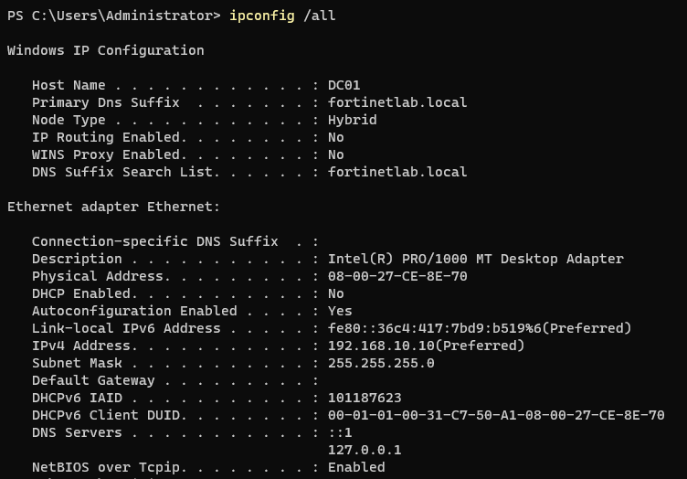

**Promoting DC01 to a domain controller for a new forest, fortinetlab.local**
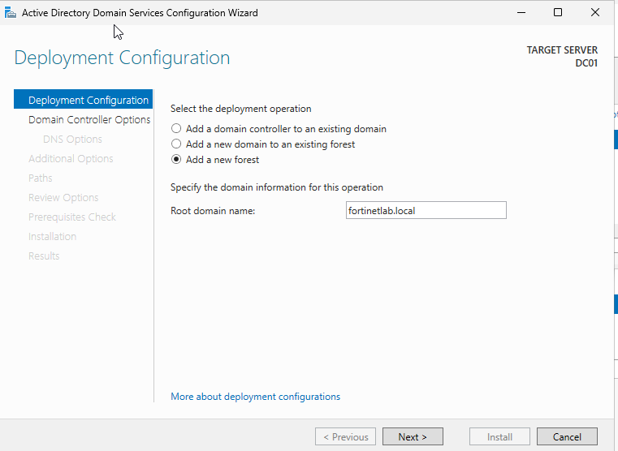

**AD DS, DNS, and DHCP roles selected for installation**
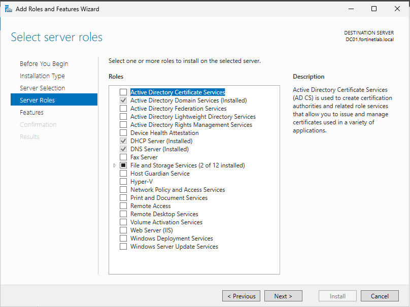

**Server Manager confirming all four roles are up on DC01**
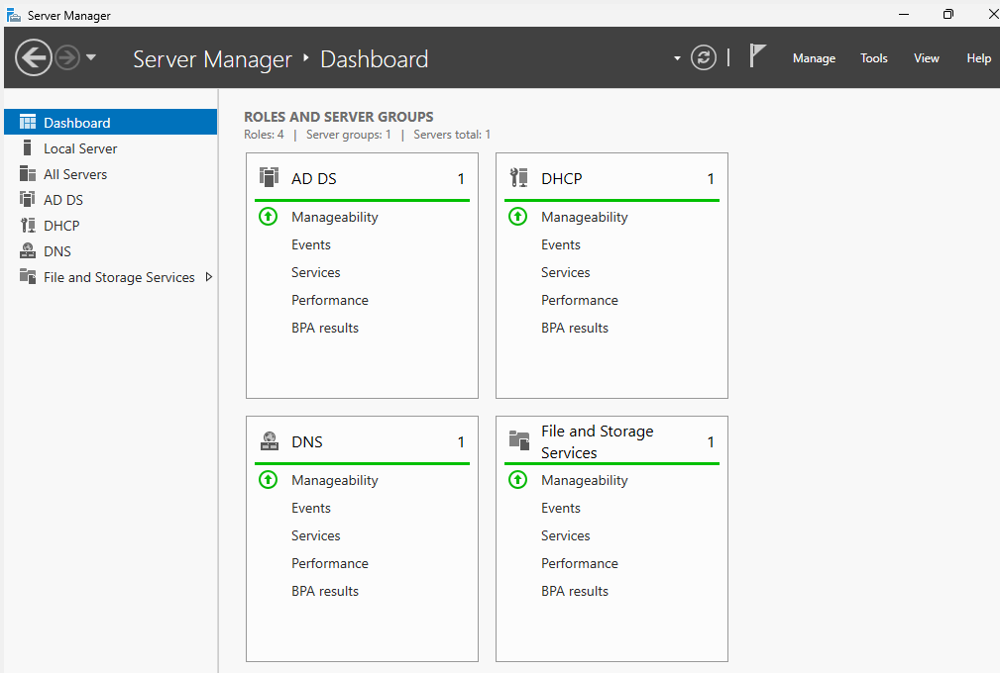

**AD-integrated forward lookup zones for fortinetlab.local**
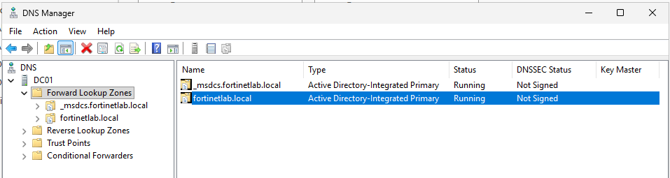

**Creating the DHCP scope (FortinetLabScope) for the lab network**
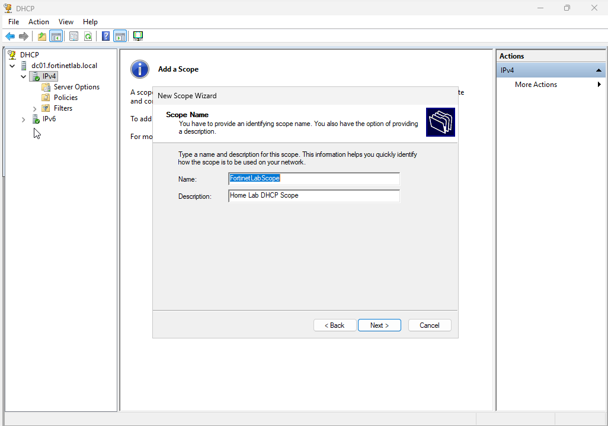

**Setting the default gateway (192.168.10.10) as a scope option**
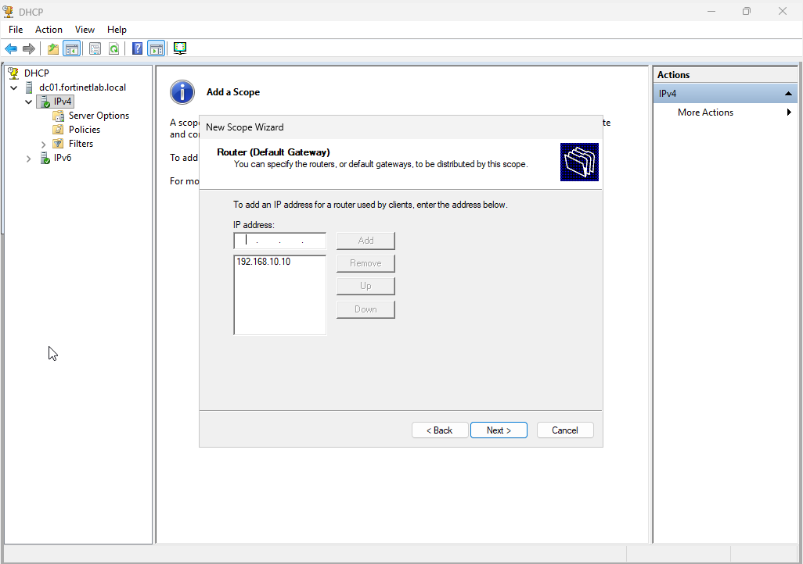

**Setting the parent domain and DNS server for scope clients**
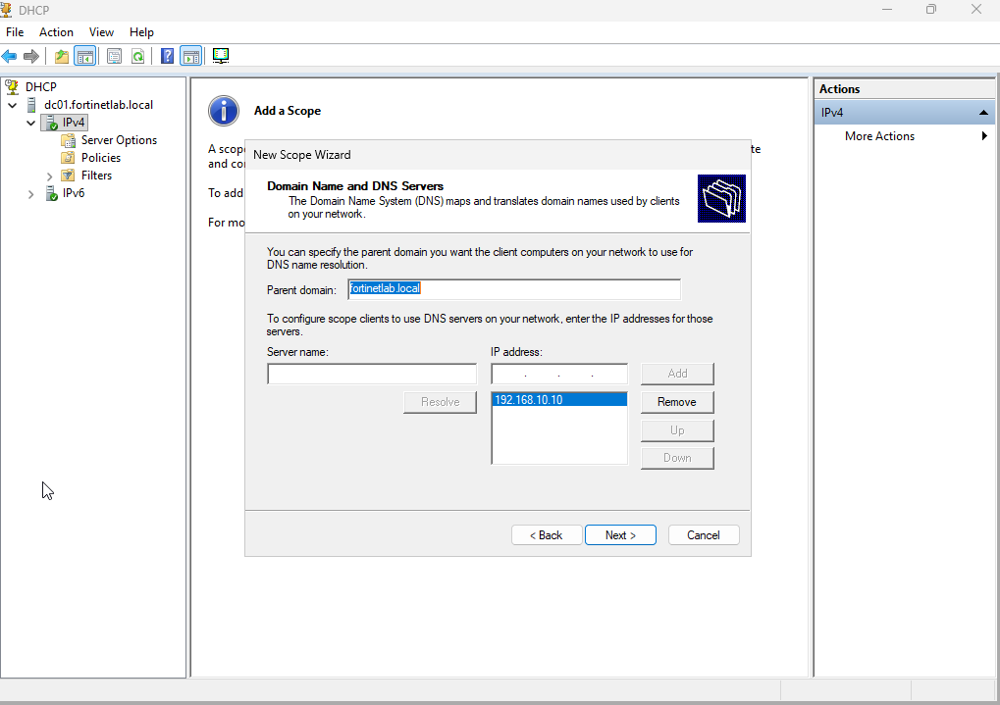

**Final scope properties: range 192.168.10.100 to .200, 8-day lease**
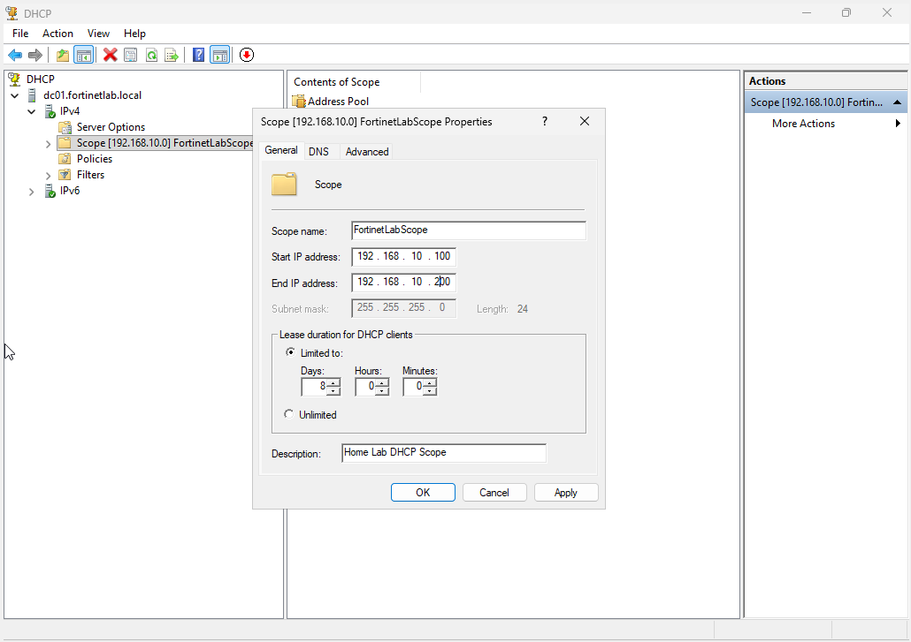

**Scope options: router, DNS server, and DNS domain name**
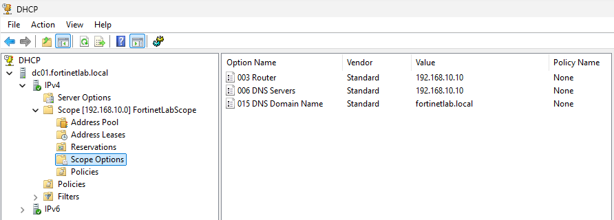

**Address pool confirming the distributed range**
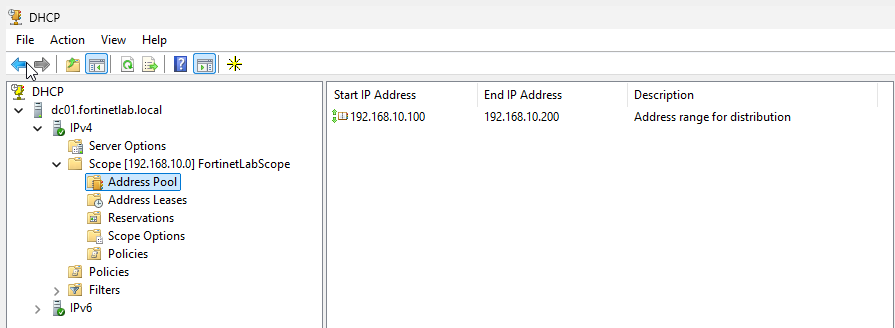
