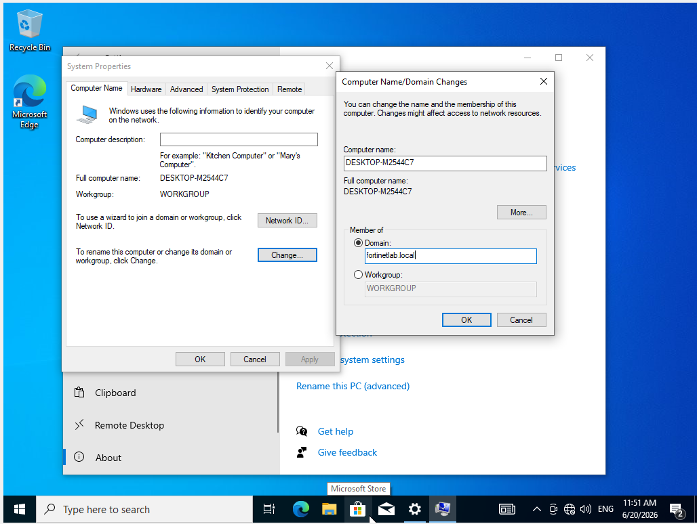
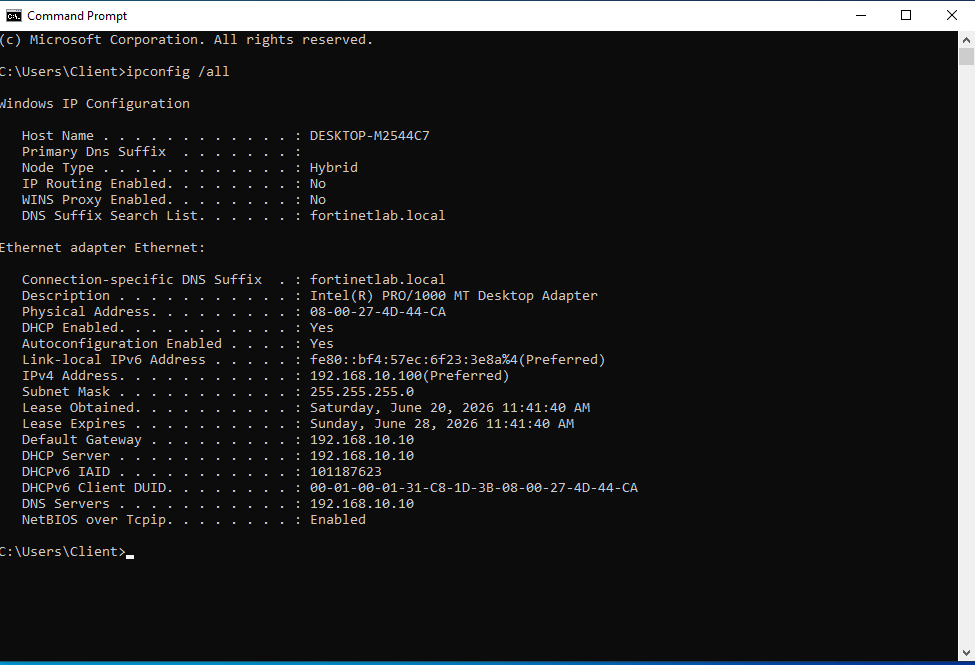
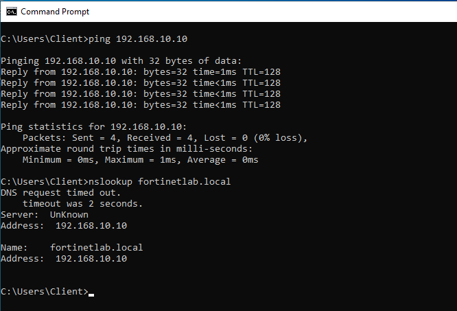

# Phase 2: Windows Client Deployment

Now that the domain was up, I added the first machine to it. I brought a Windows 10 client online, checked it was pulling DHCP and DNS from the server, and joined it to `fortinetlab.local`.

## What I Did

I joined the Windows 10 client (DESKTOP-M2544C7) to the `fortinetlab.local` domain through System Properties, then verified the plumbing behind the join. `ipconfig /all` confirmed the client had pulled a DHCP lease from DC01 (192.168.10.100, gateway and DNS both pointing at 192.168.10.10), and a ping plus `nslookup` against the domain confirmed both raw connectivity and name resolution were working end to end.

## Key Takeaways

A successful domain join depends entirely on the client being able to resolve the domain through DNS, which is why verifying the DHCP-assigned DNS server points at the domain controller is the first thing to check when a join fails. Confirming DHCP, connectivity, and DNS resolution in sequence is a repeatable troubleshooting pattern that isolates exactly where a client onboarding problem lives.

## Screenshots

**Joining the Windows 10 client to fortinetlab.local**

**ipconfig /all confirming the DHCP lease, gateway, and DNS server**

**Ping and nslookup confirming connectivity and DNS resolution to DC01**

