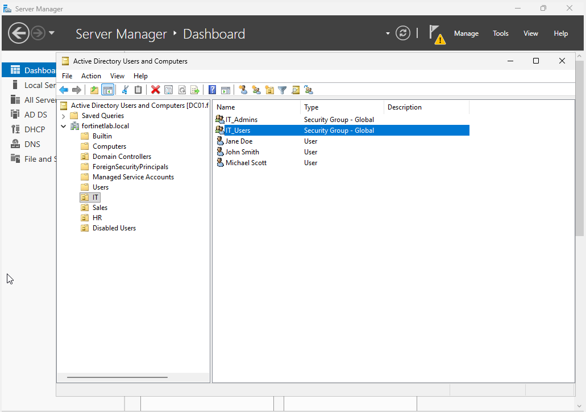
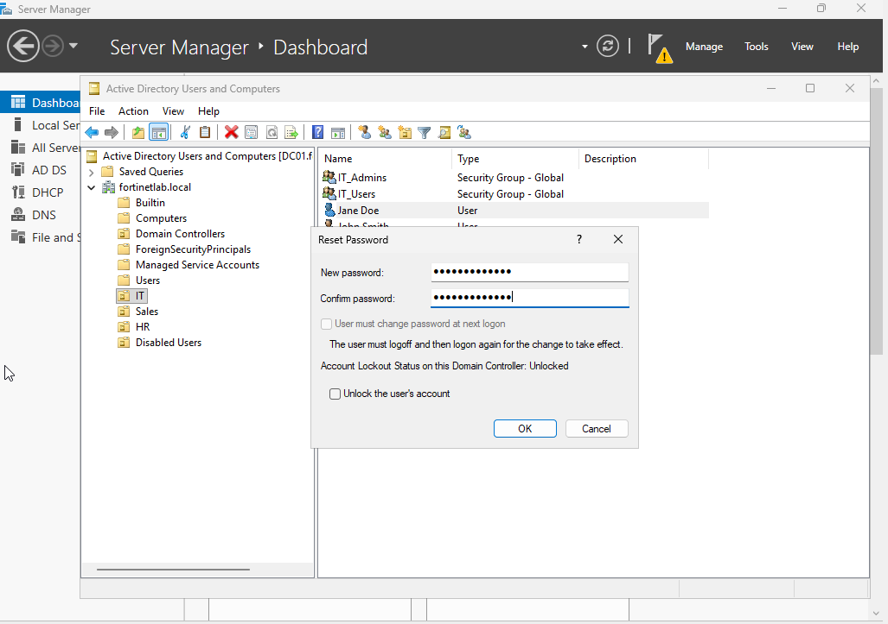
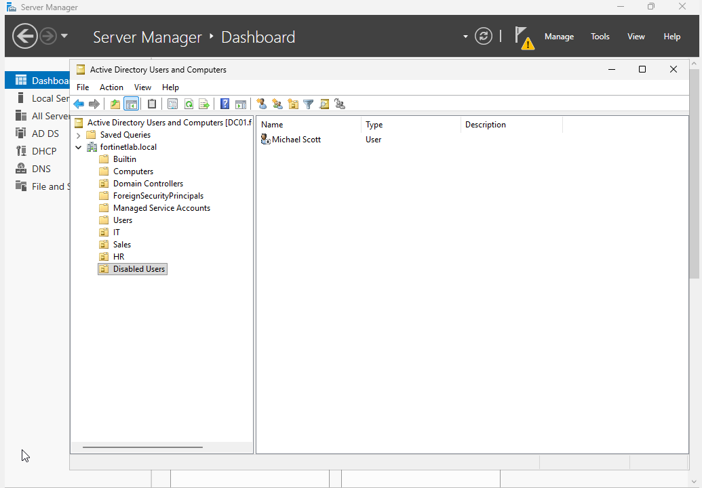

# Phase 3: Active Directory Administration

This covers the day-to-day Active Directory work. I set up OUs, users, and security groups for a small made-up company (IT, HR, Sales) and ran common tasks like password resets and disabling accounts.

## What I Did

I built out an organizational unit structure for the business (IT, HR, Sales, and a dedicated Disabled Users OU), created user accounts such as Jane Doe, John Smith, and Michael Scott, and set up security groups including IT_Admins and IT_Users to drive role-based access later on. From there I worked through common lifecycle tasks: resetting a user's password through ADUC, and disabling a departing user (Michael Scott) before moving the account into the Disabled Users OU to keep it out of the active population without deleting it outright.

## Key Takeaways

A clean OU structure is what makes everything downstream manageable, since Group Policy, delegated permissions, and directory sync all key off where an object lives. Security groups, not individual users, should own access to resources, which is why the groups get created before any share permissions. Disabling and relocating a departing account rather than deleting it preserves the audit trail and any resource ownership while immediately cutting off access, which is the standard offboarding practice.

## Screenshots

**OU structure, user accounts, and security groups in ADUC**

**Resetting a user's password through Active Directory Users and Computers**

**Disabled account moved into the Disabled Users OU during offboarding**

