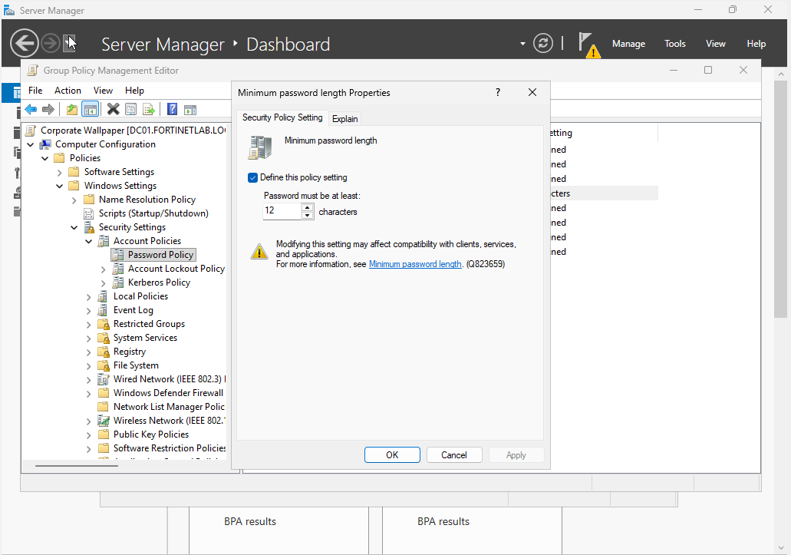
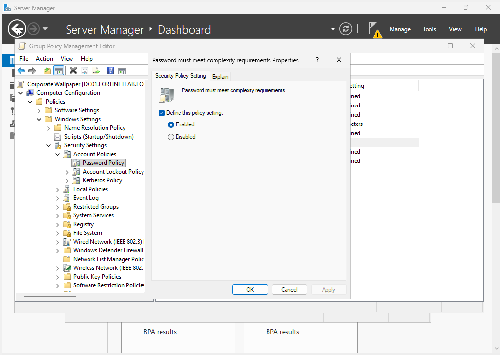
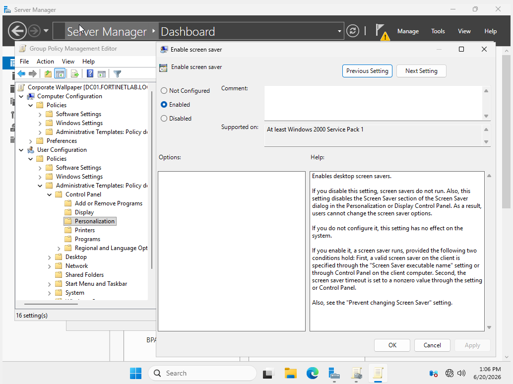
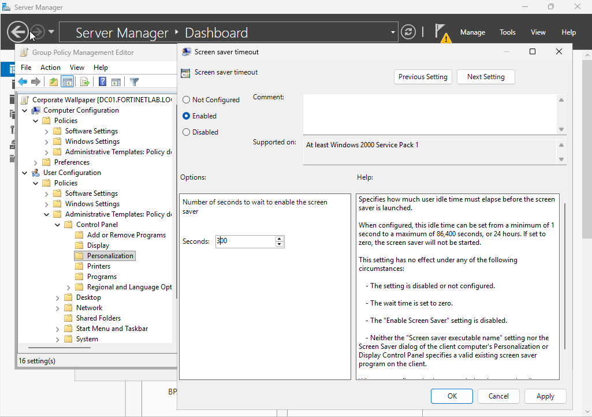
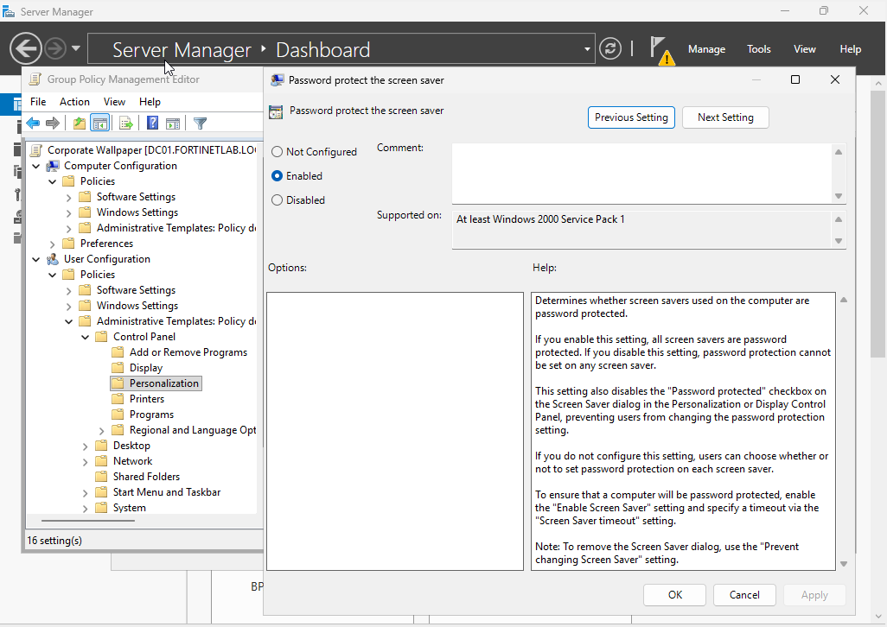
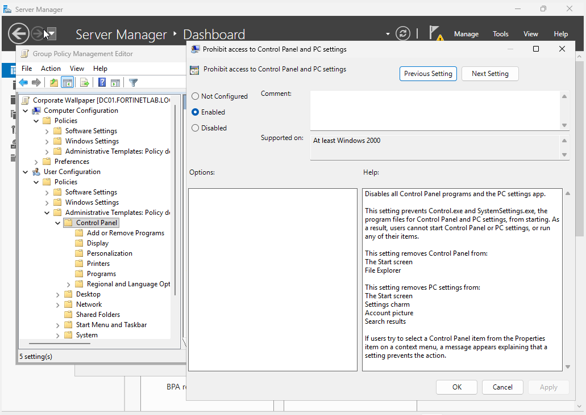
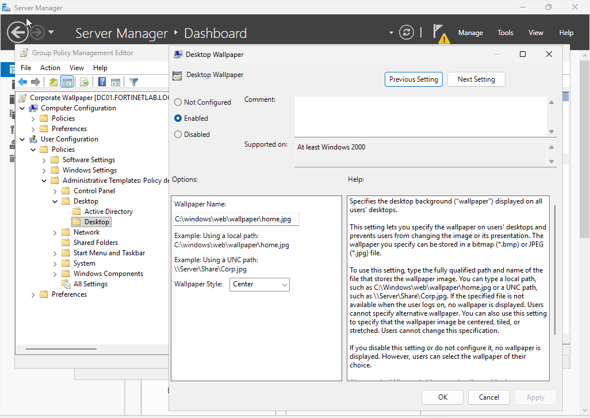
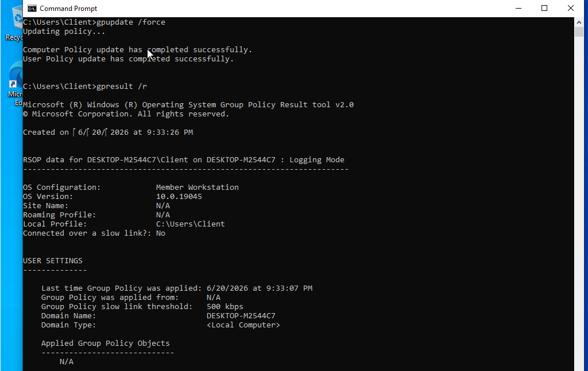
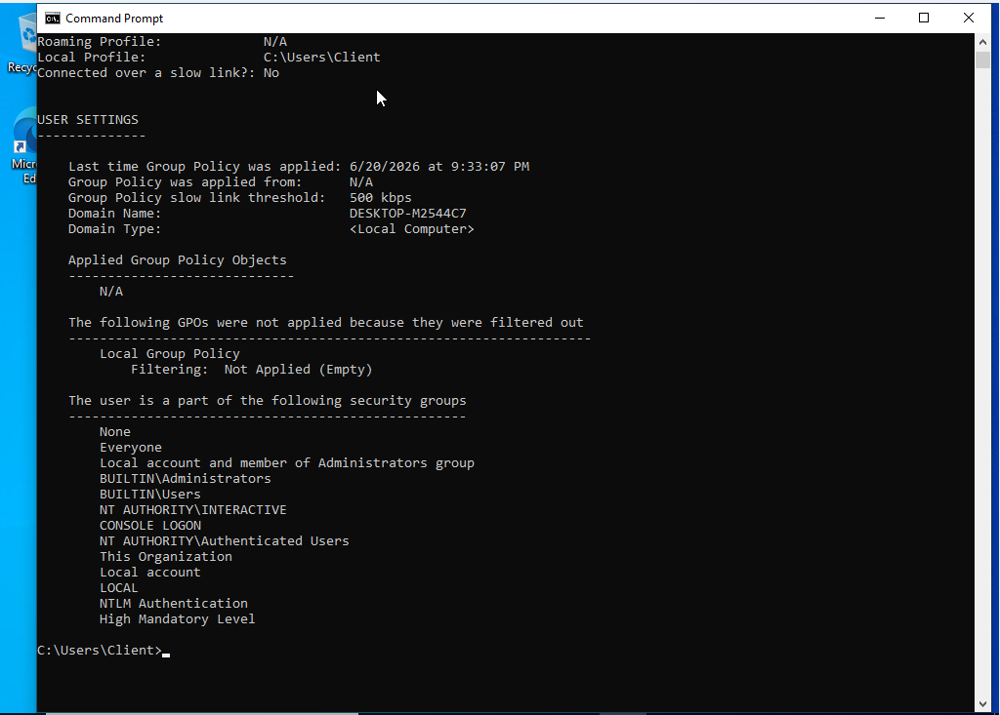

# Phase 4: Group Policy

Group Policy lets you set things on all the domain machines at once instead of one by one. I made a GPO for password rules, screen lock, a set wallpaper, and blocking Control Panel, then checked it actually applied on the client.

## What I Did

I created a Group Policy Object and configured a mix of security and user-experience settings: a minimum password length of 12 characters with complexity requirements enabled, an enforced screen saver with a 300-second idle timeout that requires a password to unlock, a standard desktop wallpaper, and a restriction that prohibits access to Control Panel and PC settings. On the Windows 10 client I then ran `gpupdate /force` to pull policy immediately and `gpresult /r` to inspect how policy was being processed on the machine.

## Key Takeaways

Password length, complexity, and an enforced, password-protected screen lock are baseline endpoint-hardening controls that Group Policy lets you apply uniformly across every domain machine. Restricting Control Panel is a simple example of reducing a standard user's ability to change system configuration. `gpupdate` and `gpresult` are the two commands you reach for constantly when troubleshooting policy. One forces a refresh, and the other shows what actually landed and why, including scope and filtering.

## Screenshots

**Minimum password length set to 12 characters**

**Password complexity requirements enabled**

**Screen saver enforced via policy**

**Screen saver idle timeout set to 300 seconds**

**Screen saver requires a password to unlock**

**Access to Control Panel and PC settings prohibited**

**Standard corporate desktop wallpaper enforced**

**Running gpupdate /force and gpresult /r on the client to check policy processing**

**gpresult output detailing applied objects, filtering, and group membership**

