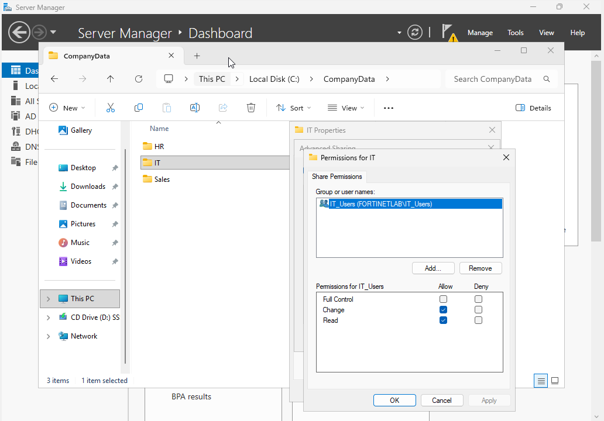
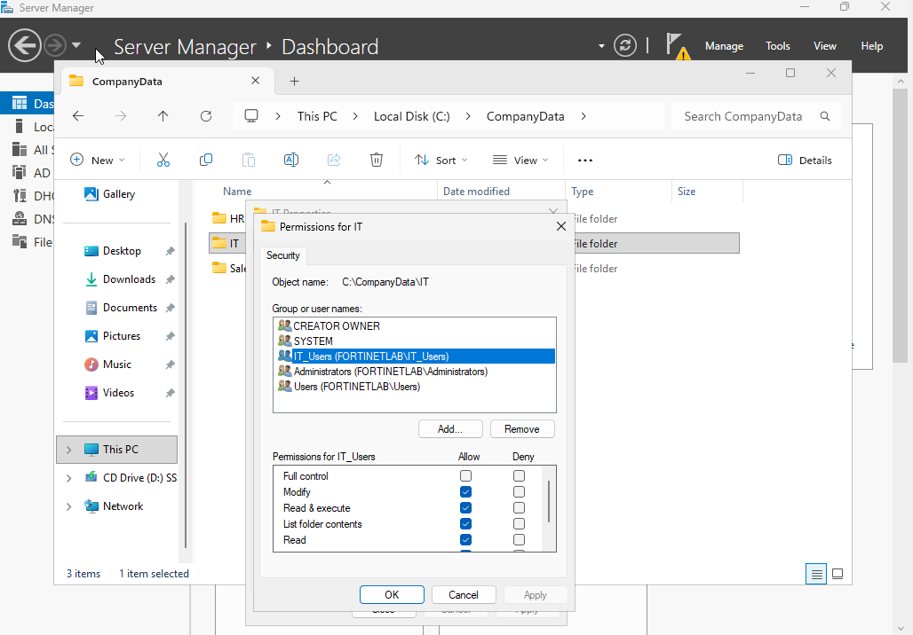
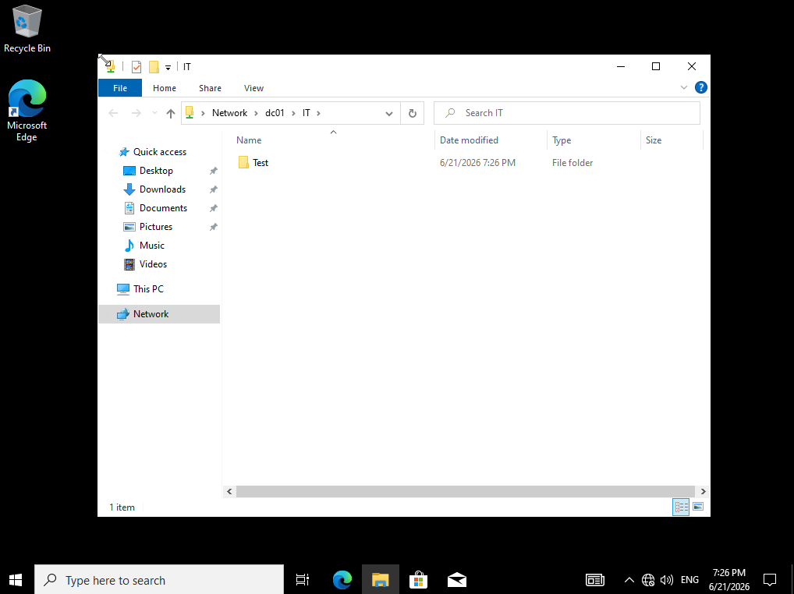

# Phase 5: File Shares & NTFS Permissions

Setting up shared folders with the right access is a really common IT job. I built a departmental share on DC01, controlled who could get in using AD security groups and share plus NTFS permissions, then tested it as a regular user.

## What I Did

I created a `CompanyData` folder on DC01 with per-department subfolders (IT, HR, Sales) and shared the IT folder. On the share I granted the IT_Users security group Change and Read permissions, and on the underlying NTFS security tab I gave IT_Users Modify. I then logged into the Windows 10 client as Jane Doe (a member of IT_Users) and browsed to `\\dc01\IT` to confirm she could reach and work in the share, validating that the group-based access chain worked end to end.

## Key Takeaways

Share and NTFS permissions are two separate layers, and the effective permission is the most restrictive of the two, so both have to be set correctly for access to behave as intended. Assigning permissions to a security group rather than to individual users is what makes access scalable: adding or removing someone from IT_Users instantly grants or revokes their access without touching the folder. Testing from an actual domain account, not just from the admin console, is the only way to be sure the permissions do what you think they do.

## Screenshots

**Share-level permissions granting IT_Users Change and Read on the IT share**

**NTFS permissions granting IT_Users Modify on C:\CompanyData\IT**

**Jane Doe (IT_Users) accessing \\dc01\IT from the Windows 10 client**

