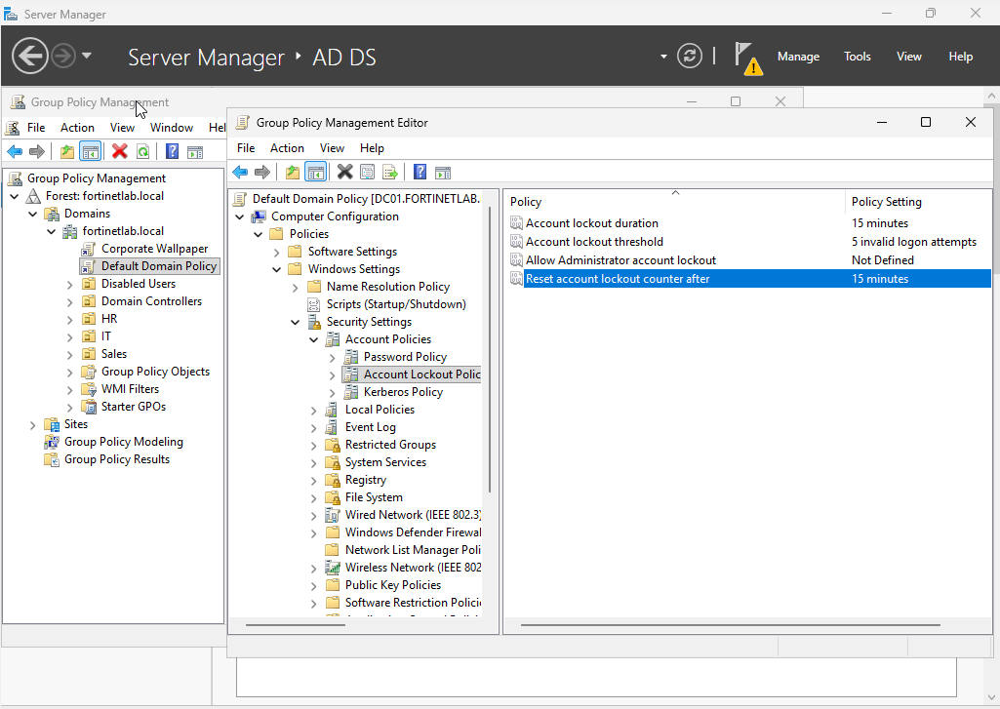
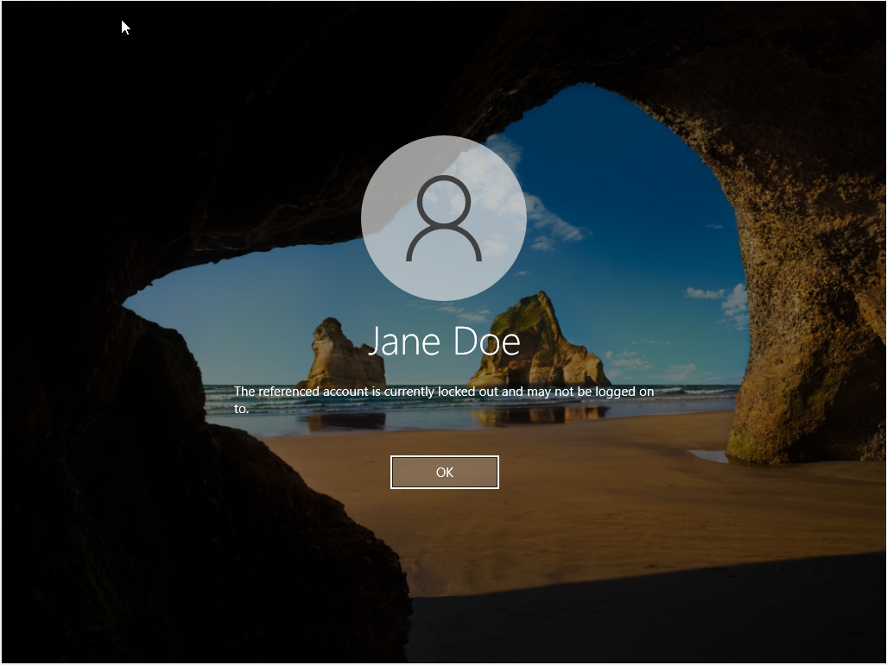
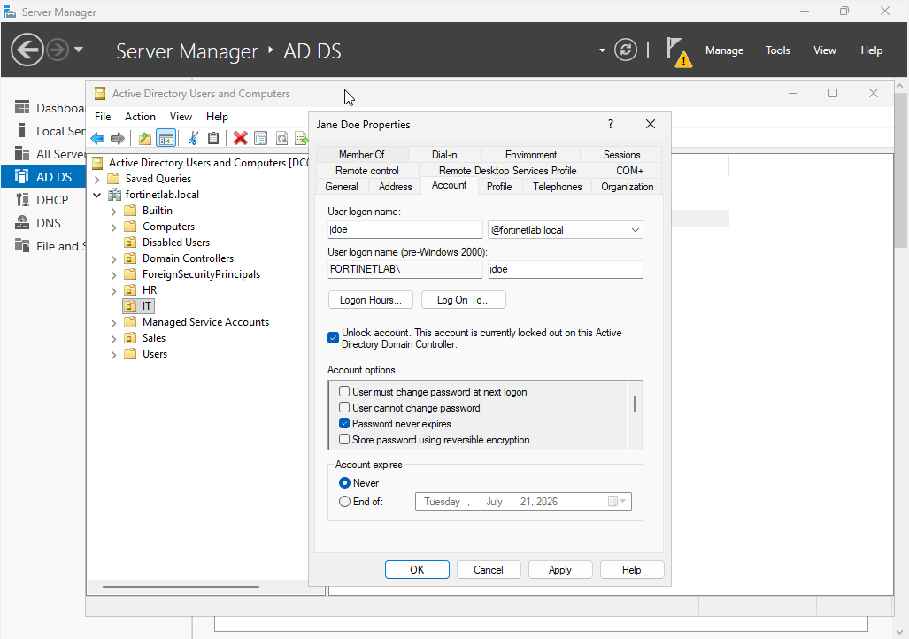
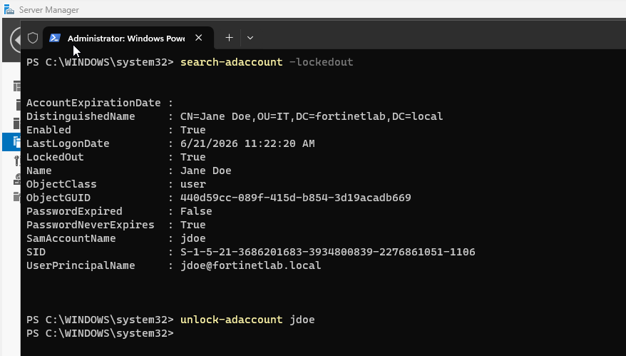

# Phase 6: Account Lockout & Recovery

Getting locked out of an account happens all the time. I set up a lockout policy, locked an account on purpose by typing the wrong password too many times, and then unlocked it both in ADUC and with PowerShell.

## What I Did

In the Default Domain Policy I set an account lockout threshold of 5 invalid logon attempts, a 15-minute lockout duration, and a 15-minute reset counter. I then logged into the Windows 10 client as Jane Doe and entered the wrong password repeatedly until Windows reported the account as locked. To recover it, I used two methods: unchecking the "Unlock account" box on the user's Account tab in ADUC, and running `Search-ADAccount -LockedOut` followed by `Unlock-ADAccount` in PowerShell to find and clear the lock from the command line.

## Key Takeaways

A lockout threshold protects against password-guessing attacks, but it also generates real support load, so the threshold and durations are a security-versus-usability tradeoff worth understanding. Knowing both the ADUC and PowerShell recovery paths matters: the GUI is fine for a one-off, while `Search-ADAccount -LockedOut` and `Unlock-ADAccount` scale to scripting and bulk scenarios. Being able to confirm the locked state, identify the account, and clear it quickly is a core help desk competency.

## Screenshots

**Account lockout policy: threshold 5, 15-minute duration and reset**

**Client reporting the account as locked out after five failed attempts**

**Unlocking the account through the Account tab in ADUC**

**Finding and clearing the lock with Search-ADAccount and Unlock-ADAccount**

