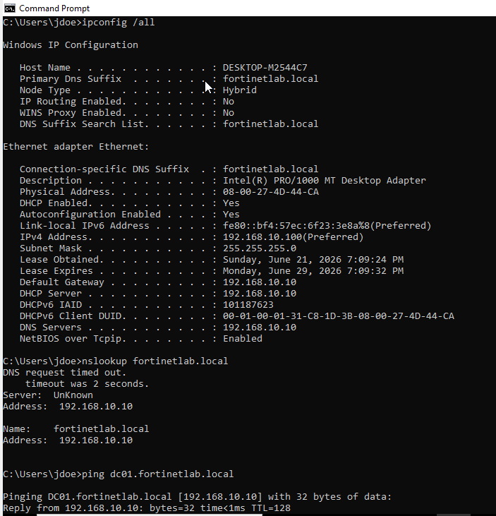
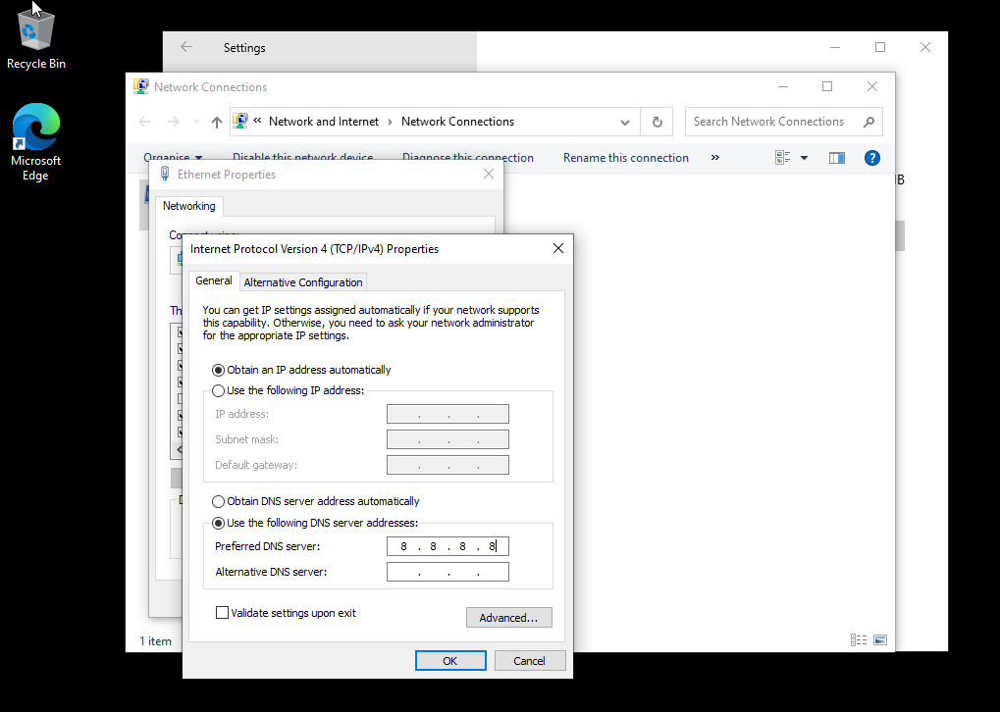
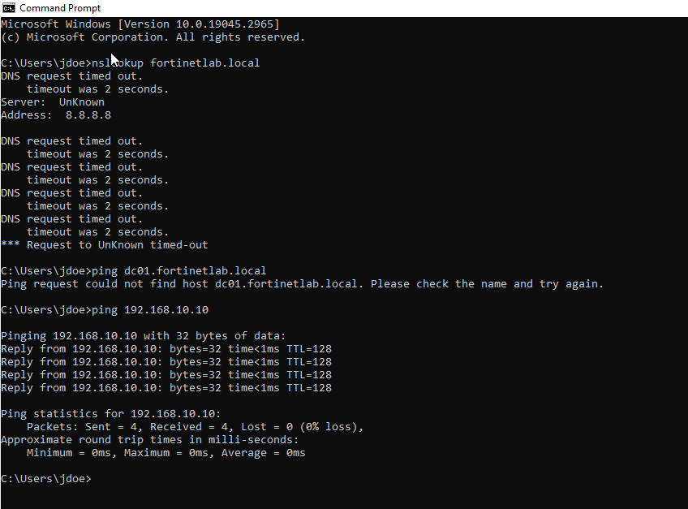
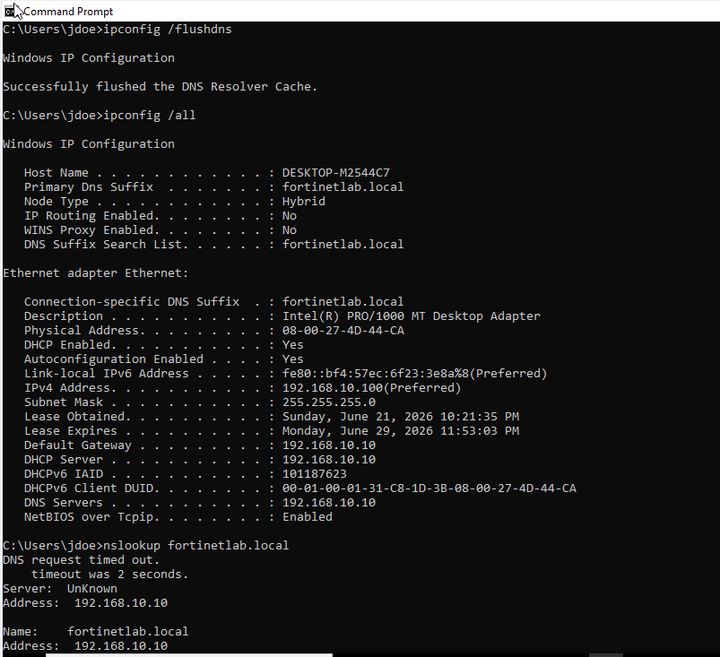
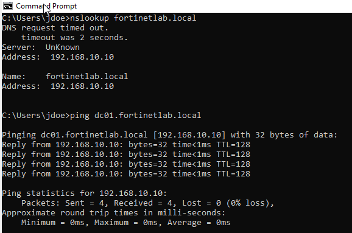

# Phase 7: DNS Troubleshooting

A lot of "the network is down" problems are really just DNS. I broke DNS on a client on purpose, then used the usual command line tools to track down what was wrong and fix it.

## What I Did

I started from a healthy baseline, confirming the client's DNS pointed at DC01 (192.168.10.10) and that `nslookup` and `ping` against the domain both worked. I then simulated a misconfiguration by manually setting the client's preferred DNS server to 8.8.8.8, a public resolver that knows nothing about the internal `fortinetlab.local` domain. Retesting showed the classic split symptom: `nslookup` and `ping dc01.fortinetlab.local` failed with name-resolution errors, while `ping 192.168.10.10` by IP still succeeded, proving the network path was fine and the fault was DNS. I resolved it by switching the adapter back to obtain DNS automatically, running `ipconfig /flushdns`, and confirming resolution was fully restored.

## Key Takeaways

The single most useful test in this kind of ticket is pinging by IP versus by name: if the IP works and the name doesn't, the problem is DNS, not connectivity. In an AD environment, clients must use the internal DNS server, because pointing them at a public resolver breaks domain name resolution even though internet DNS still works. Flushing the resolver cache after a change is what clears stale negative lookups so the fix takes effect immediately.

## Screenshots

**Baseline: client DNS points at DC01 and resolution works**

**Simulating the fault: preferred DNS manually changed to 8.8.8.8**

**Symptoms: name resolution fails while ping by IP still succeeds**

**Restoring automatic DNS and flushing the resolver cache**

**Resolution restored: nslookup and ping by name working again**

