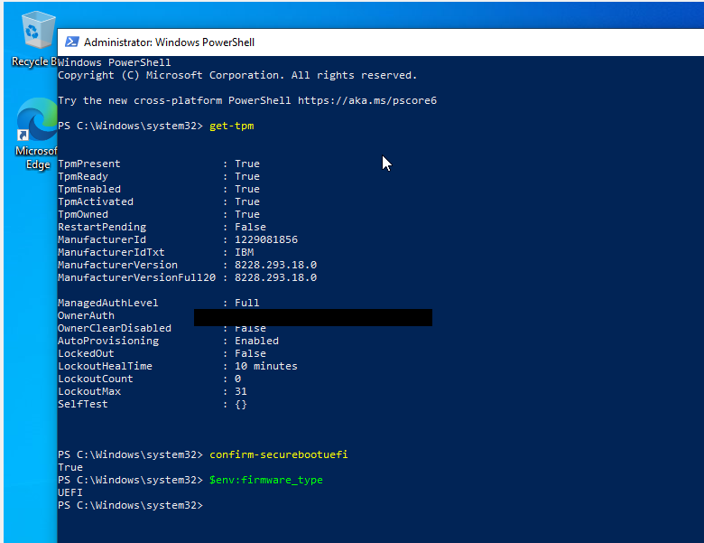
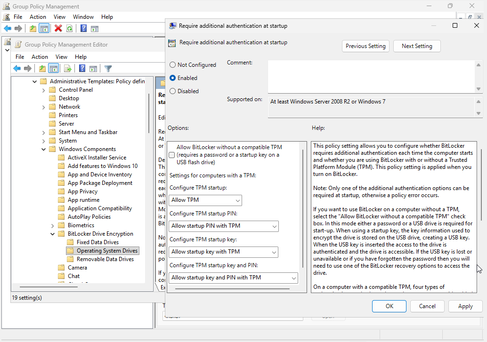
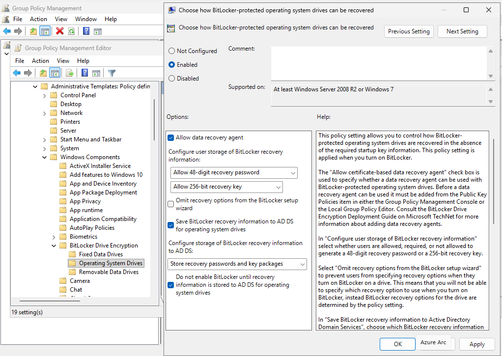
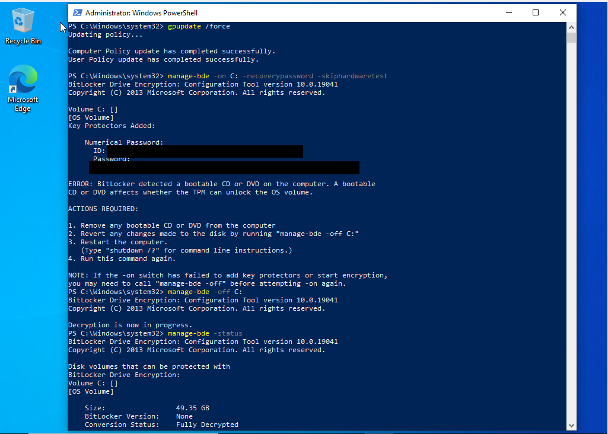
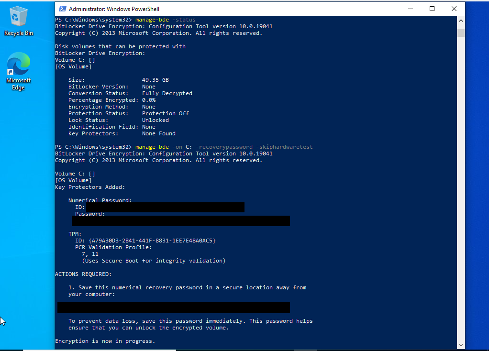
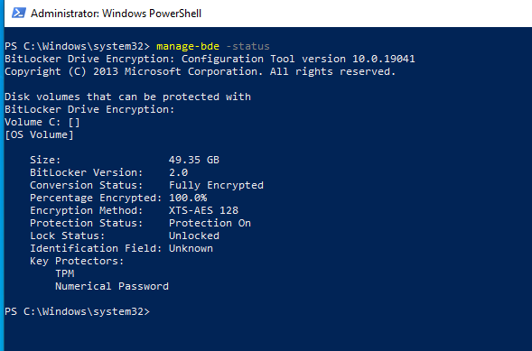
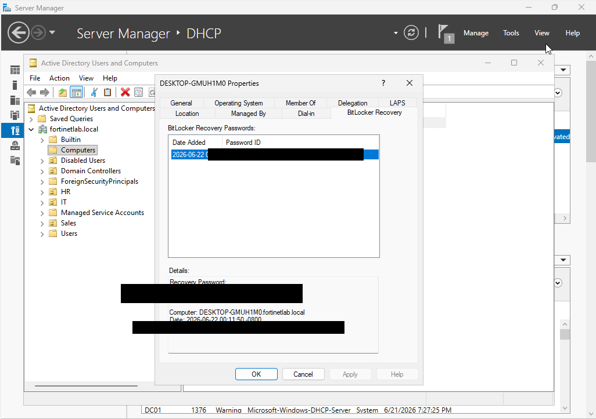

# Phase 8: BitLocker Encryption & AD Recovery

BitLocker encrypts the drive, and being able to get the recovery key back matters if someone gets locked out. I built a VM with TPM and UEFI, turned on BitLocker, set a GPO to back the recovery key up to AD, and then practiced pulling that key back.

## What I Did

Because the original Windows 10 client was installed in Legacy BIOS mode with no TPM, I built a separate VM (WIN10-UEFI-BITLOCKER) with UEFI, Secure Boot, and TPM 2.0 enabled, and confirmed all three with `Get-Tpm`, `Confirm-SecureBootUEFI`, and `$env:firmware_type`. On DC01 I configured a Group Policy Object to require BitLocker recovery information to be stored in AD DS before encryption is allowed. Enabling BitLocker with `manage-bde` surfaced a real-world snag, since a still-mounted ISO blocked TPM validation. I cleaned that up before re-running the command to add the TPM and numerical-password key protectors and start encryption. Once the drive reported fully encrypted (XTS-AES, protection on), I confirmed the recovery key had automatically escrowed to the computer object in Active Directory, then opened the BitLocker Recovery tab in ADUC to simulate a help desk retrieving that key for a user.

> Note: BitLocker recovery passwords, key-protector IDs, and the TPM OwnerAuth value have been redacted from these screenshots.

## Key Takeaways

BitLocker on an OS drive depends on the hardware being right, meaning UEFI, Secure Boot, and a TPM, which is why verifying those first saves a lot of wasted effort. Escrowing recovery keys to AD via GPO is the piece that makes encryption manageable at scale: without it, a user who can't get past the recovery prompt means unrecoverable data. Knowing where to find that key in ADUC, and doing it before you actually need to, is exactly the muscle memory a support role requires.

## Screenshots

**Verifying TPM 2.0, Secure Boot, and UEFI firmware on the client**

**GPO requiring additional authentication at startup for OS drives**

**GPO escrowing BitLocker recovery information to AD DS**

**First attempt blocked by a mounted ISO, then cleaned up with manage-bde -off**

**Key protectors added (TPM + numerical password) and encryption started**

**Drive fully encrypted with XTS-AES and protection on**

**Recovery key automatically escrowed to the computer object in Active Directory**

