# Phase 9: Microsoft Entra ID Hybrid Identity Sync

Hybrid identity means the on-prem AD accounts also show up in the cloud so people log in with the same account everywhere. I installed Entra Connect Sync and set it up to sync `fortinetlab.local` into an Entra tenant with password hash sync and Seamless SSO.

## What I Did

I ran the Microsoft Entra Connect Sync wizard on DC01, choosing the Customize path rather than Express Settings because `fortinetlab.local` is a non-routable domain that needs deliberate handling. I selected Password Hash Synchronization with Seamless SSO as the sign-in method, connected the on-premises forest using an enterprise admin account, scoped synchronization down to the specific OUs I wanted synced, and let Azure manage the source anchor. After completing the wizard, the configuration finished successfully and the initial sync ran. I confirmed the result three ways: the on-premises users (Jane Doe, John Smith, Michael Scott) appeared in the Entra tenant with "on-premises sync enabled" set to Yes, `Get-ADSyncScheduler` showed a healthy 30-minute delta sync cycle on DC01, and a synced user's Entra profile showed its on-premises attributes sourced from `fortinetlab.local`.

## Key Takeaways

A non-routable `.local` domain can't be verified in Entra ID, which is exactly why the Customize path and UPN handling matter, because Express Settings would leave users unable to sign in with their on-premises credentials. Password Hash Synchronization keeps a hash of the on-prem password in the cloud so users have one set of credentials, while Seamless SSO removes repeated prompts on domain-joined machines. Verifying a sync isn't just "did the wizard finish," it's confirming objects actually landed in the cloud, the scheduler is healthy, and individual accounts show the correct on-premises source.

## Screenshots

**Choosing Customize over Express Settings for the non-routable domain**
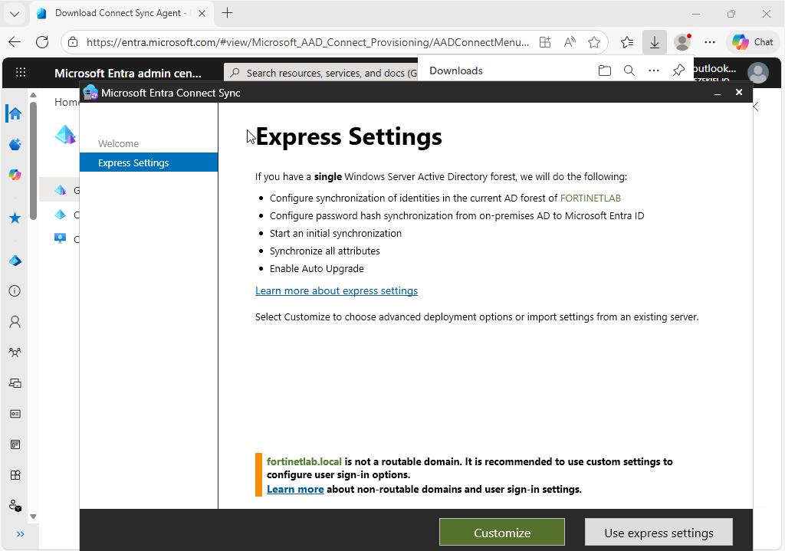

**Installing the required synchronization components**
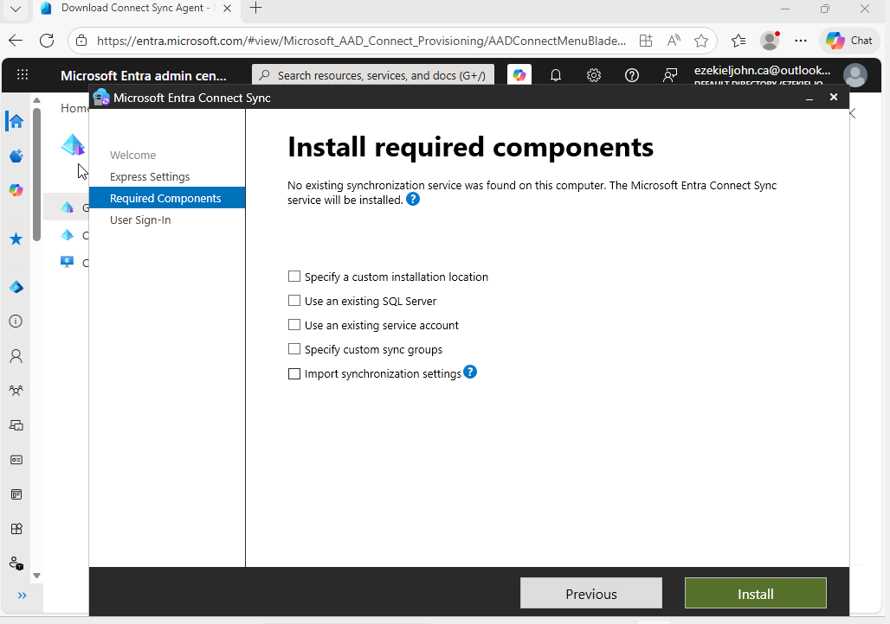

**Selecting Password Hash Synchronization with Seamless SSO**
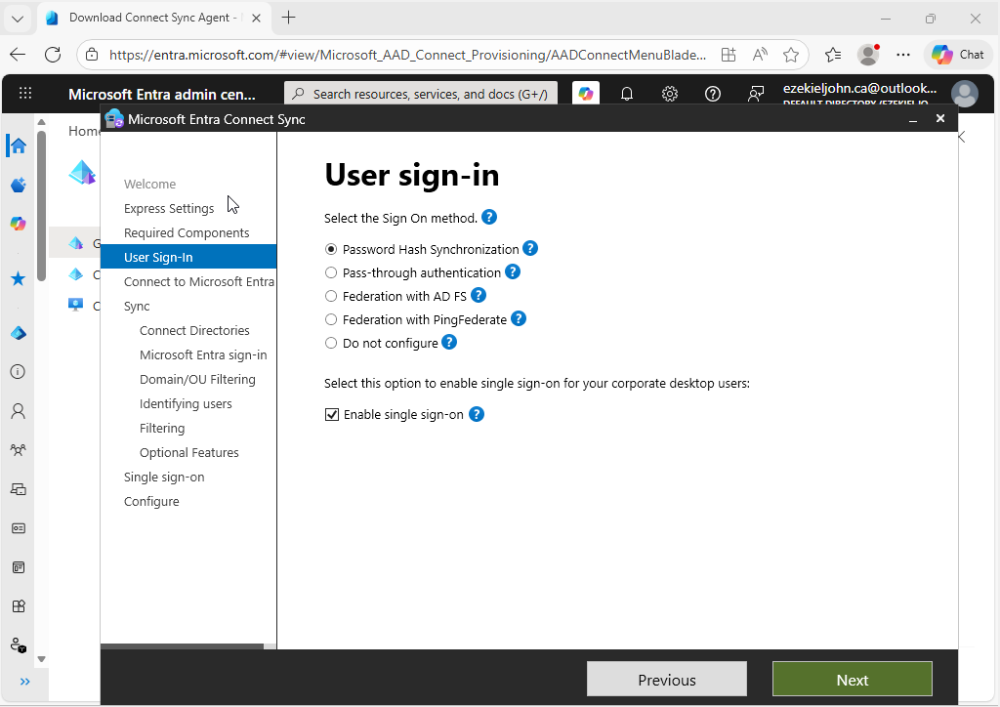

**Connecting the on-premises fortinetlab.local forest**
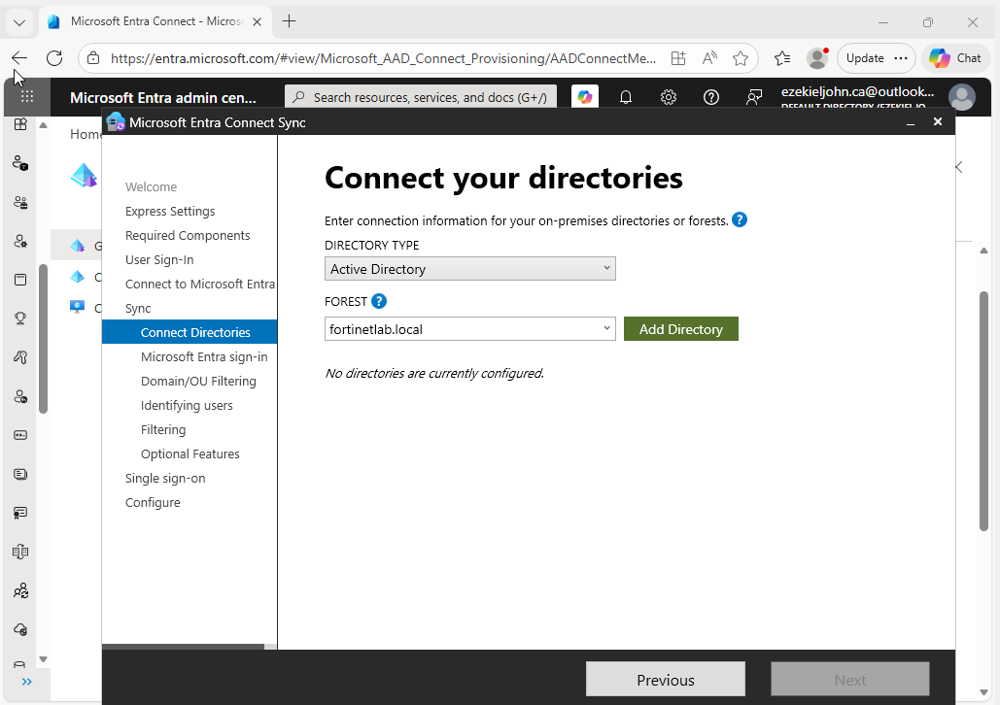

**Providing the AD forest account for periodic synchronization**
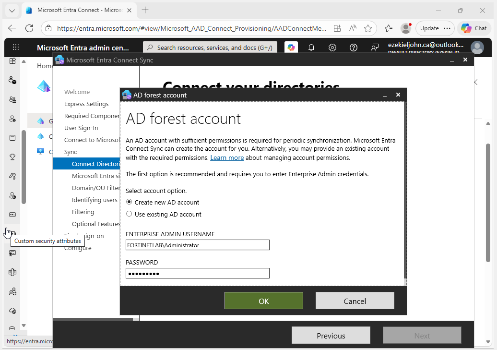

**Entra sign-in configuration showing the UPN suffix and domain status**
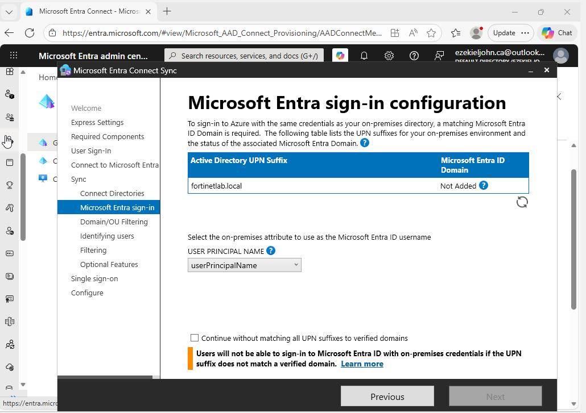

**Scoping synchronization to selected OUs**
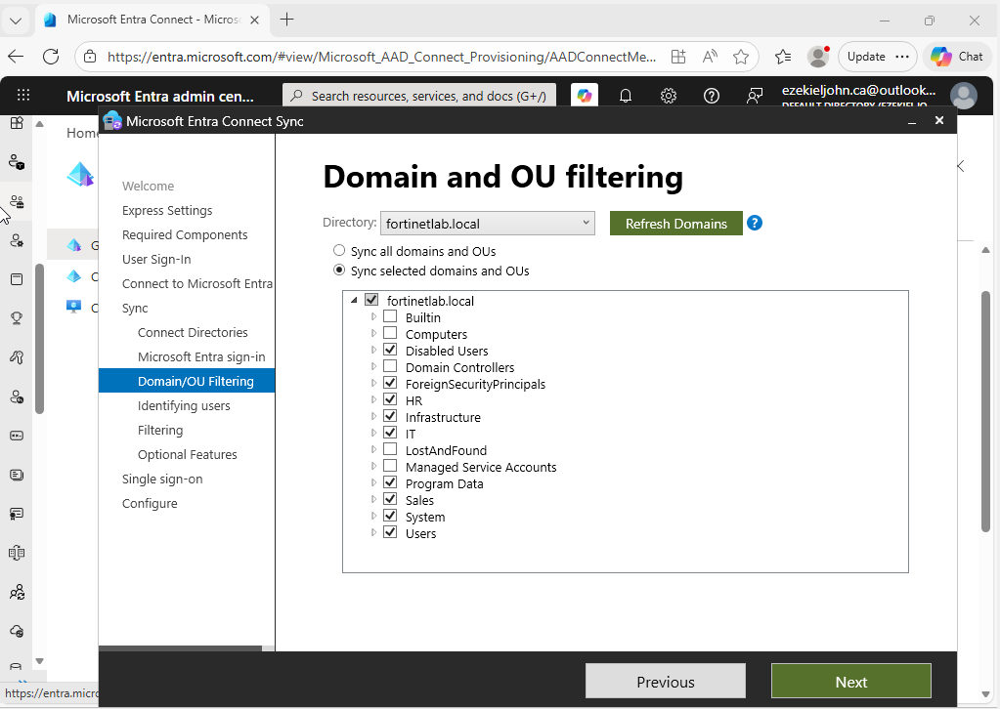

**Choosing how users are uniquely identified across directories**
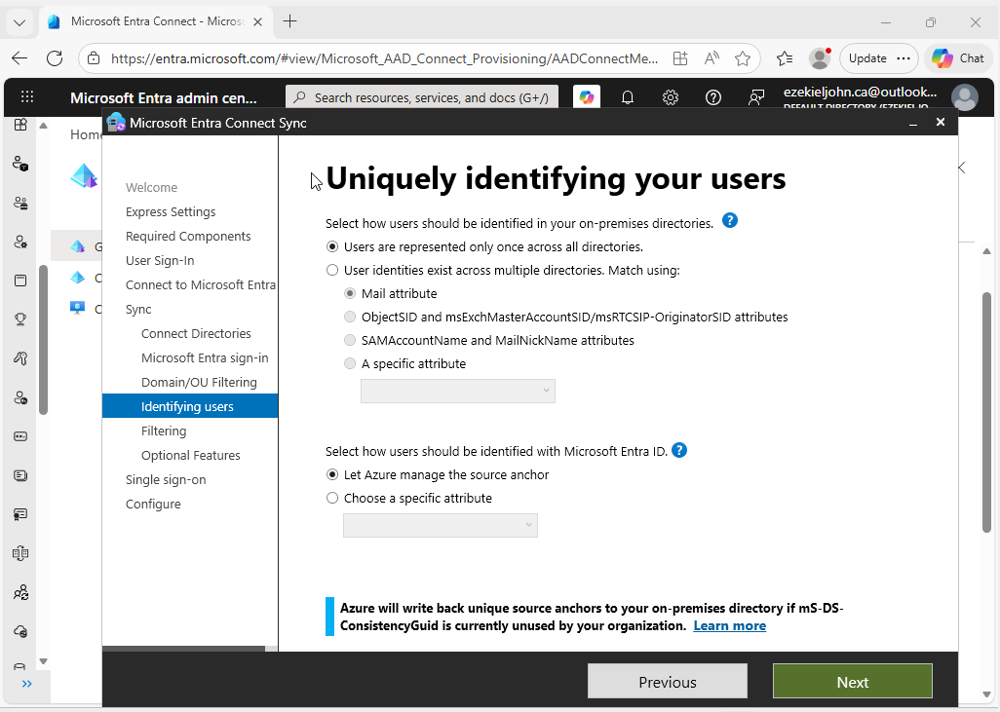

**Filtering which users and devices synchronize**
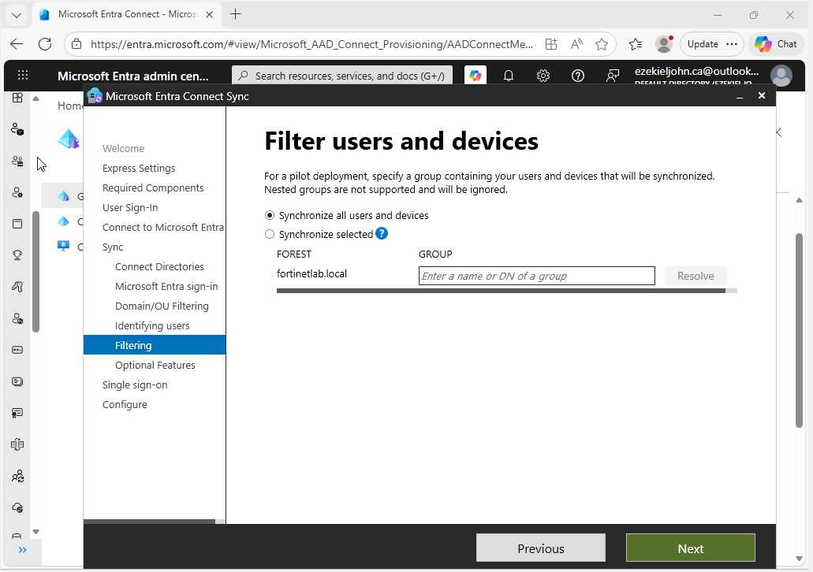

**Optional features: Password Hash Synchronization enabled**
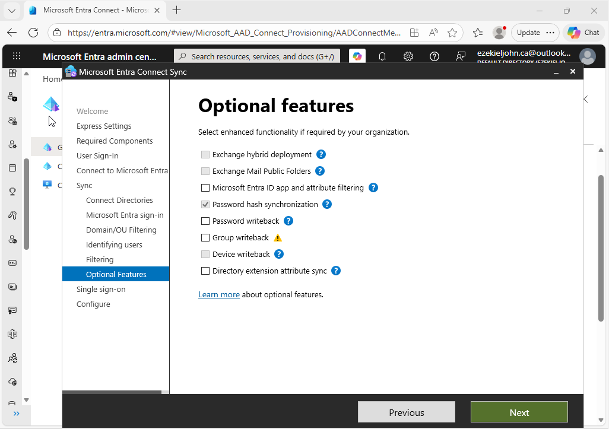

**Enabling Seamless Single Sign-On for the on-premises forest**
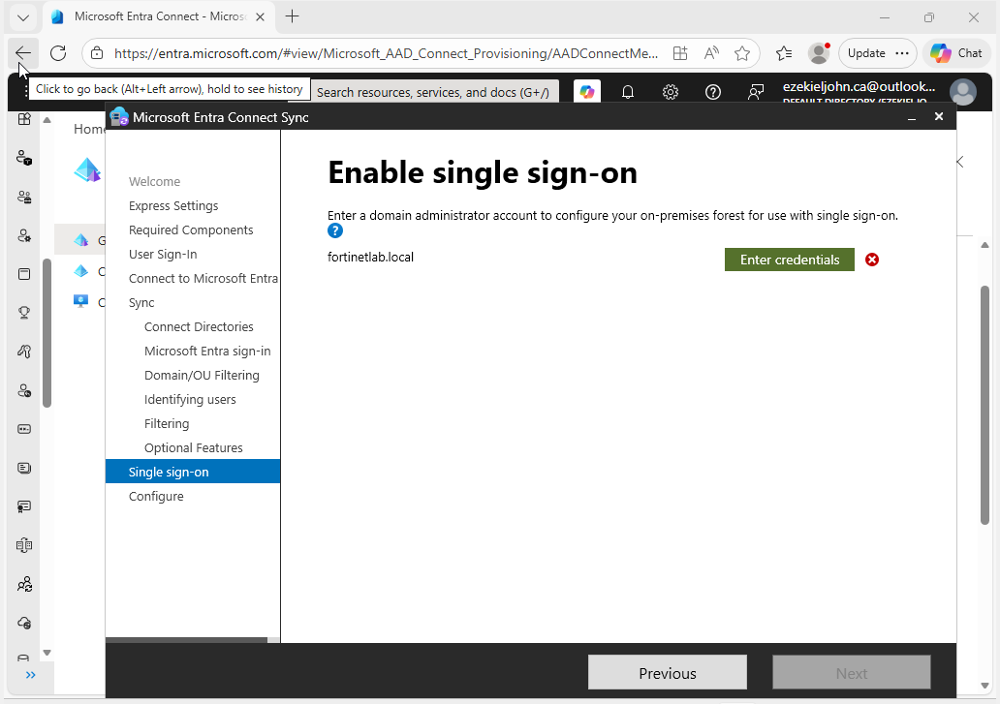

**Review of everything the wizard will configure**
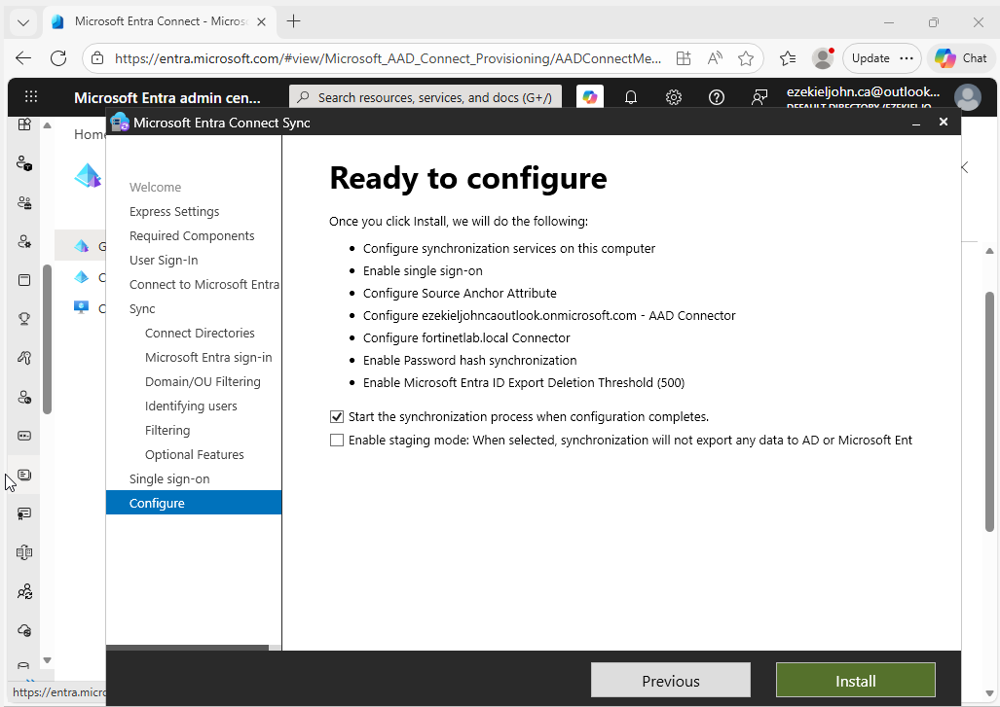

**Configuration complete and initial synchronization initiated**
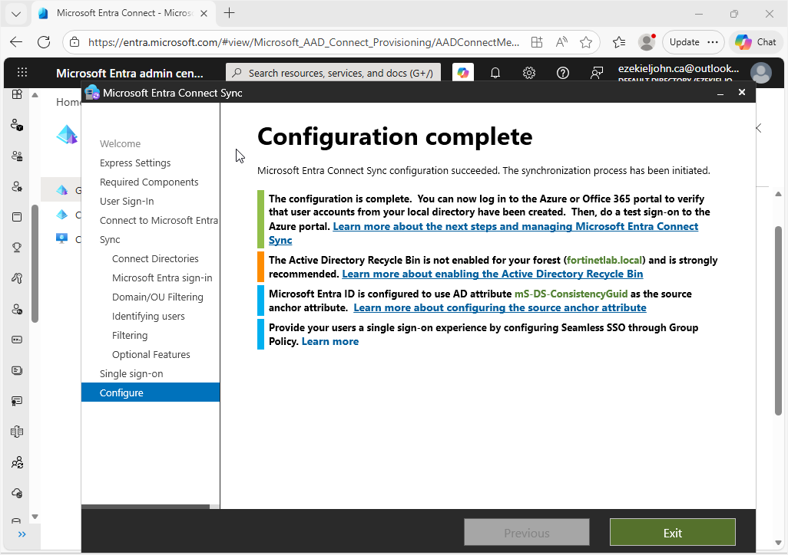

**On-premises users synced into the Entra tenant with sync enabled**
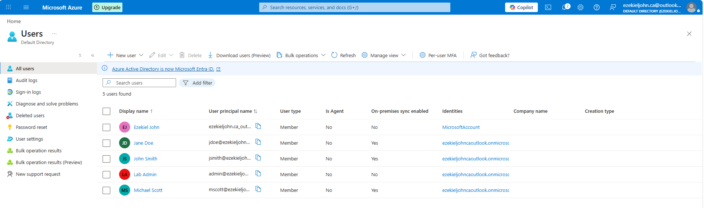

**Get-ADSyncScheduler confirming a healthy 30-minute delta sync cycle**
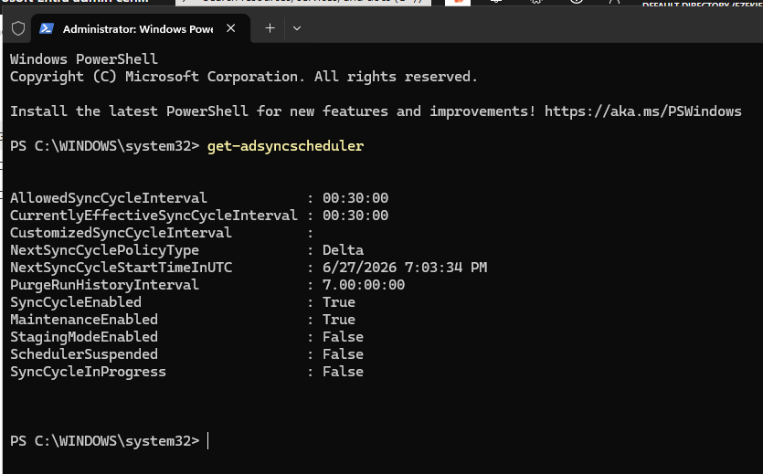

**A synced user's Entra profile sourced from fortinetlab.local**
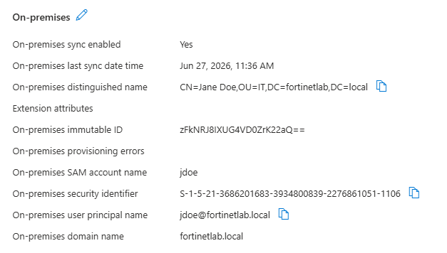
