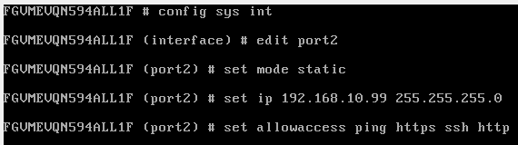
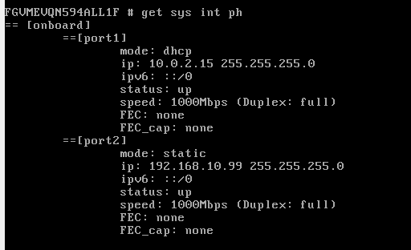
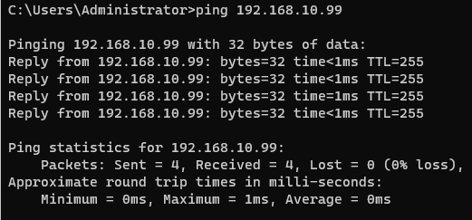
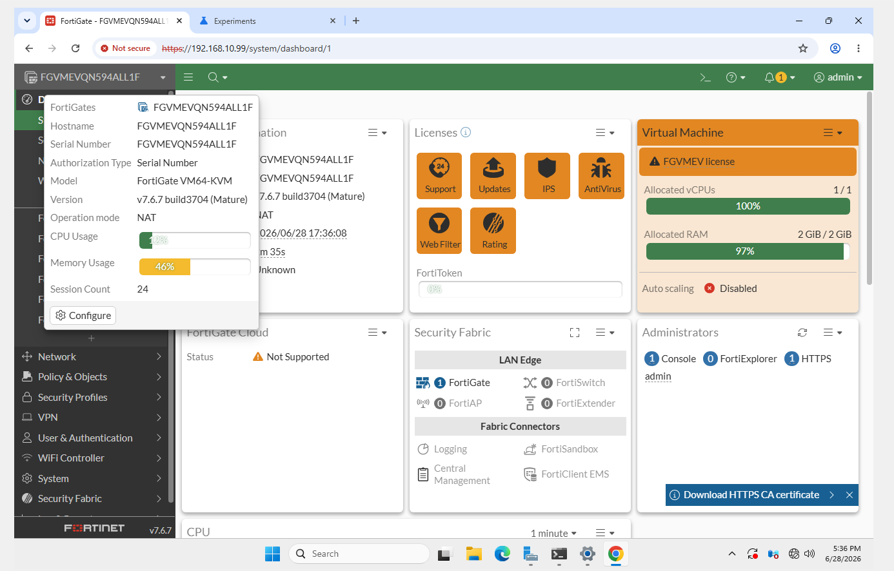
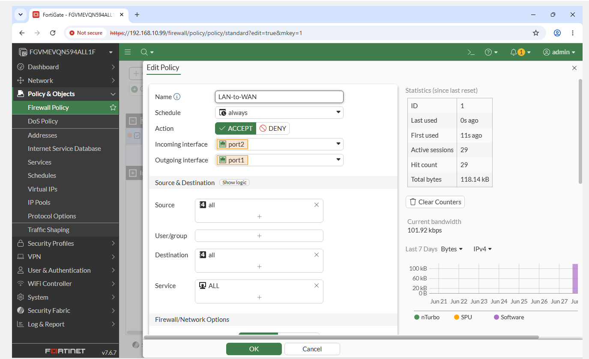
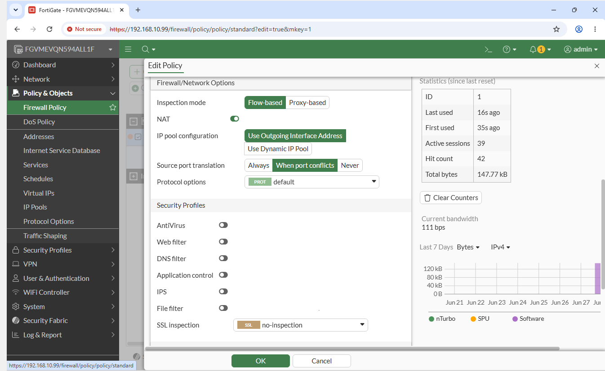
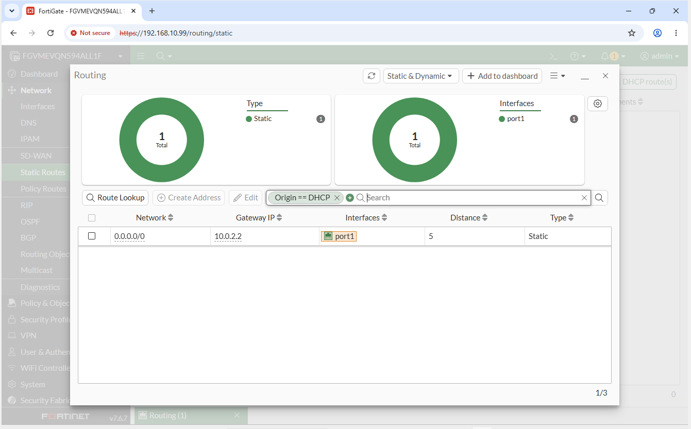
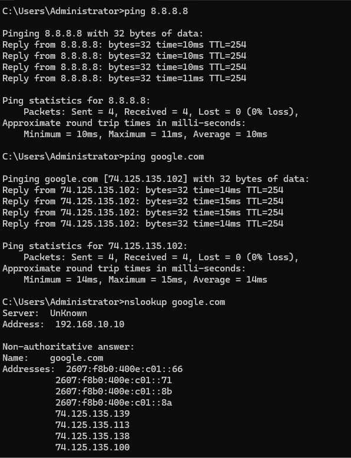
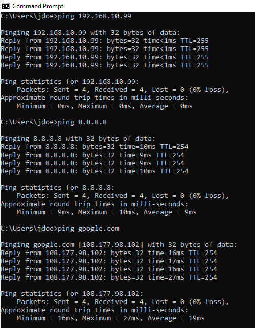
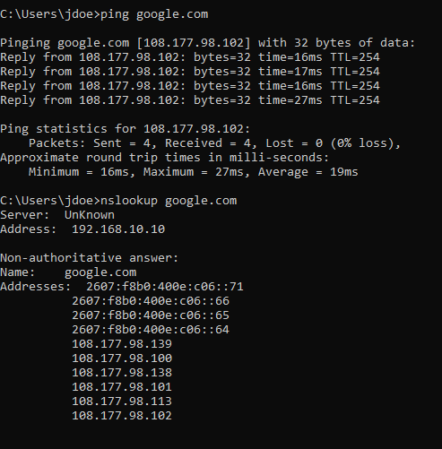

# Phase 10: FortiGate LAN-to-WAN Connectivity

This is where I added the FortiGate firewall so the domain machines could get out to the internet. I set up the interfaces, routing, NAT, and a LAN to WAN firewall rule, then tested that everything could actually reach the internet.

## What I Did

I placed the FortiGate in NAT mode with port1 as the WAN, taking a DHCP-assigned address on the VirtualBox NAT network, and port2 as the LAN gateway (192.168.10.99) for the 192.168.10.0/24 domain network. From the CLI I set the LAN interface's static address and allowed management access (ping, HTTPS, SSH), then confirmed DC01 could reach the FortiGate. In the web GUI I verified the device details (FortiGate VM64, FortiOS 7.6.7, NAT mode, evaluation license) and built a single LAN→WAN firewall policy (port2 to port1, source and destination all, service ALL, action ACCEPT) with source-NAT using the outgoing interface address and security profiles left off, so I could validate raw connectivity first. A static default route (0.0.0.0/0) pointed out port1 to the upstream gateway. I then ran a layered validation from DC01, running ping to 8.8.8.8, ping to google.com, and nslookup, and repeated the internet test from a standard domain user (Jane Doe) to confirm the whole path worked end to end.

## Key Takeaways

Getting a device online is a layered problem, and testing it in layers is what makes troubleshooting fast: ping the gateway to prove reachability, ping a public IP to prove routing and NAT, ping a hostname to prove DNS, and run nslookup to isolate DNS on its own. Source-NAT on the outgoing interface is what lets the internal RFC 1918 network reach the internet through a single public-facing address. Deliberately leaving security profiles off at first is a sound approach, since you confirm the plumbing works before you introduce anything that could block traffic and muddy the diagnosis.

## Screenshots

**Configuring the LAN (port2) interface at 192.168.10.99 from the CLI**

**Verifying interface configuration and allowed management access**

**Confirming the FortiGate is reachable from DC01**

**FortiGate dashboard: VM64, FortiOS 7.6.7, NAT mode, evaluation license**

**LAN-to-WAN firewall policy (port2 → port1, action ACCEPT)**

**Policy NAT settings: source-NAT on outgoing interface, security profiles off**

**Static default route out the WAN interface (port1)**

**End-to-end internet validation from DC01 (ping and nslookup)**

**Internet validation from domain user Jane Doe: gateway, IP, and hostname**

**Internet validation from Jane Doe continued: DNS resolution**

