# Phase 11: Intune Hybrid Microsoft Entra Join

This phase connects the on-prem domain to Microsoft Intune. I took a domain-joined Windows 10 client, hybrid-joined it to Entra ID, enrolled it into Intune, and pushed a config profile to confirm it worked.

## What I Did

I used Microsoft Entra Connect to configure Hybrid Microsoft Entra Join, which writes a Service Connection Point (SCP) into AD so domain-joined machines can discover the tenant, and verified that SCP both from the client (`dsregcmd /status` showing DomainJoined) and from DC01 (`Get-ADObject` finding the Device Registration Configuration in the Configuration partition). Because `fortinetlab.local` is non-routable, I added the verified Microsoft-provided domain as an alternate UPN suffix in AD Domains and Trusts and confirmed it with `Get-ADForest`, then extended OU sync to include the Workstations OU so the device would sync. In Entra ID the client showed a Join type of "Microsoft Entra hybrid joined," and the on-prem users appeared in the tenant. I assigned Microsoft 365 E5 licenses (which include Intune), enabled MDM auto-enrollment for hybrid-joined devices, and pushed the Intune auto-enrollment GPO to the Workstations OU. The device picked up enrollment (`dsregcmd` now showing AzureAdJoined) and appeared in the Intune console as managed and compliant. Finally I built a Settings Catalog configuration profile to disable Windows Copilot, assigned it to the IT_Users group, and captured the client before and after, with Copilot present, then gone once the profile applied.

## Key Takeaways

Hybrid Entra Join is the bridge that lets a traditional domain-joined machine also be a cloud-managed device, and it hinges on the SCP being discoverable and the UPN suffix matching a verified domain, so the same non-routable-domain problem from the sync phase resurfaces here. Auto-enrollment via GPO is what makes Intune scale: devices enroll themselves once the policy and licensing are in place, rather than being touched individually. Proving management end to end means pushing a real policy and confirming it changed the endpoint, and the before/after Copilot capture is that proof.

## Screenshots

**Configuring Hybrid Microsoft Entra Join in Entra Connect**
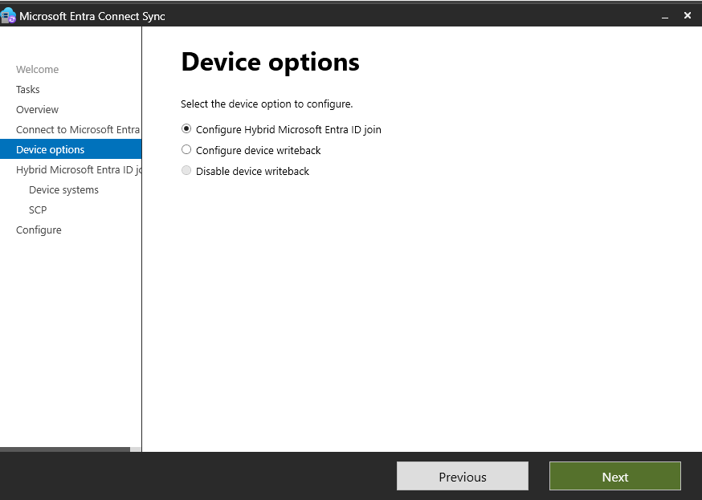

**SCP configuration writing the service connection point to the forest**
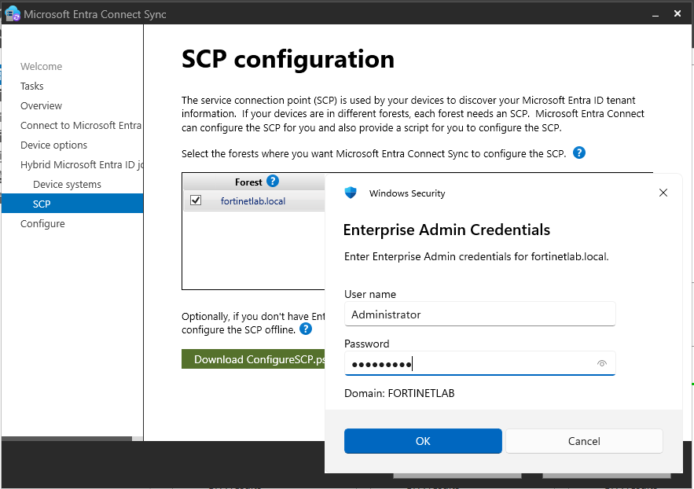

**Verifying the SCP from the client with dsregcmd showing DomainJoined**
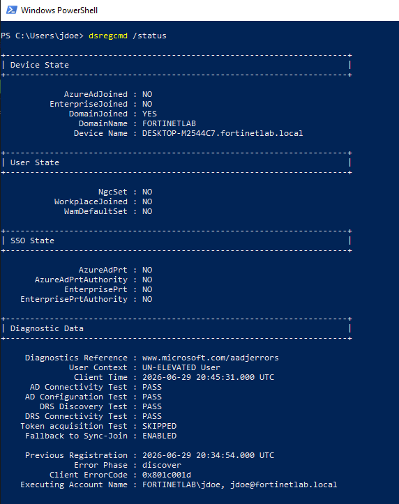

**Verifying the Device Registration Configuration object from DC01**
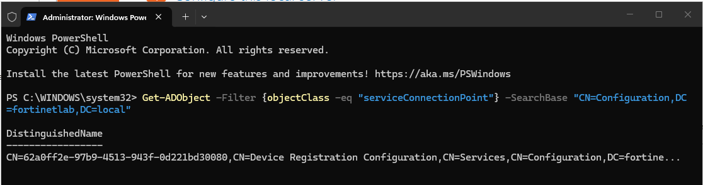

**Adding the verified Entra domain as an alternate UPN suffix**
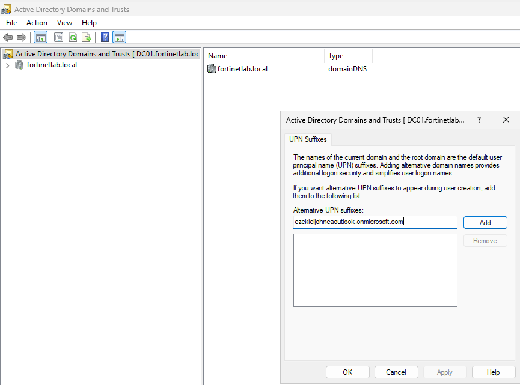

**Confirming the UPN suffix with Get-ADForest**
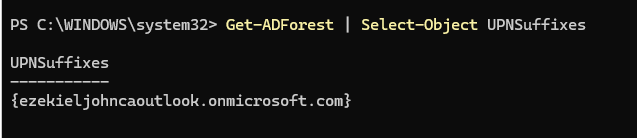

**Extending OU sync to include the Workstations OU**
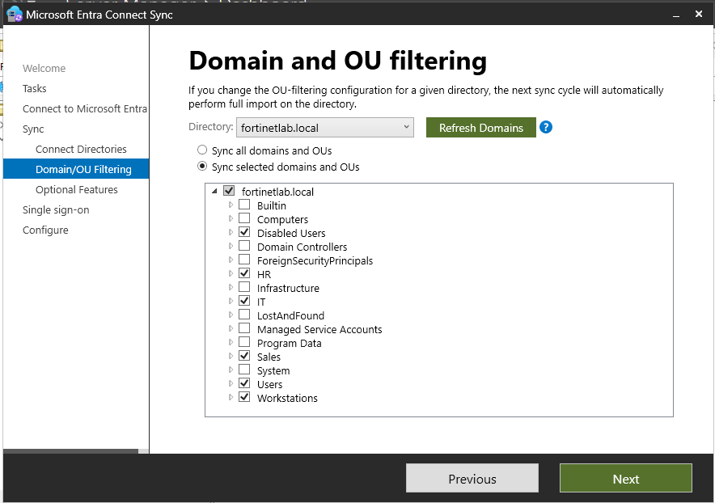

**Client showing Join type "Microsoft Entra hybrid joined" in Entra ID**
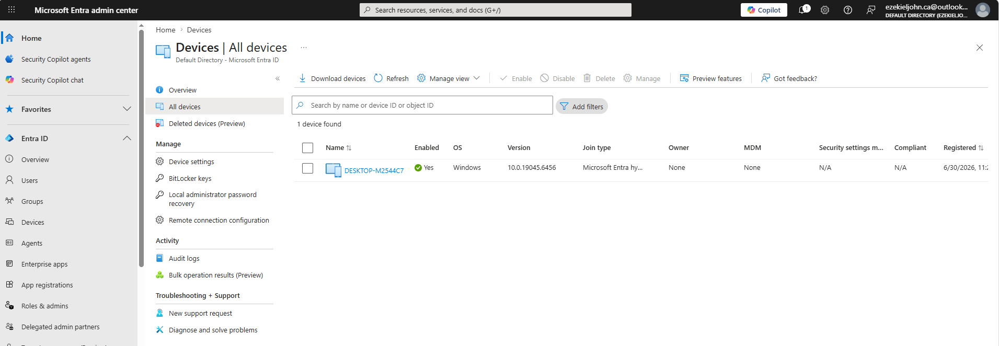

**On-premises users present in the Entra tenant**
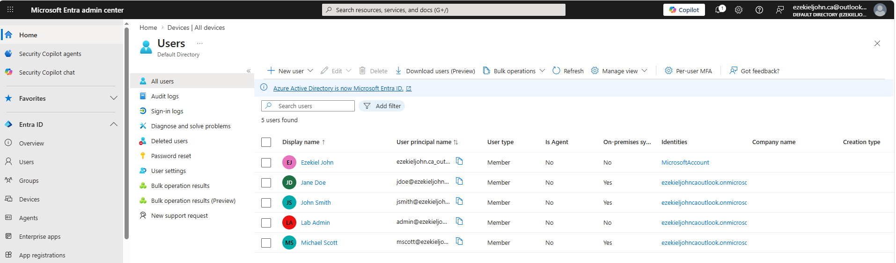

**Assigning Microsoft 365 E5 licenses (which include Intune)**
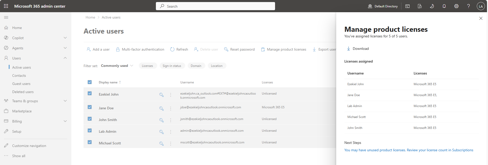

**Enabling MDM auto-enrollment scope in Intune**
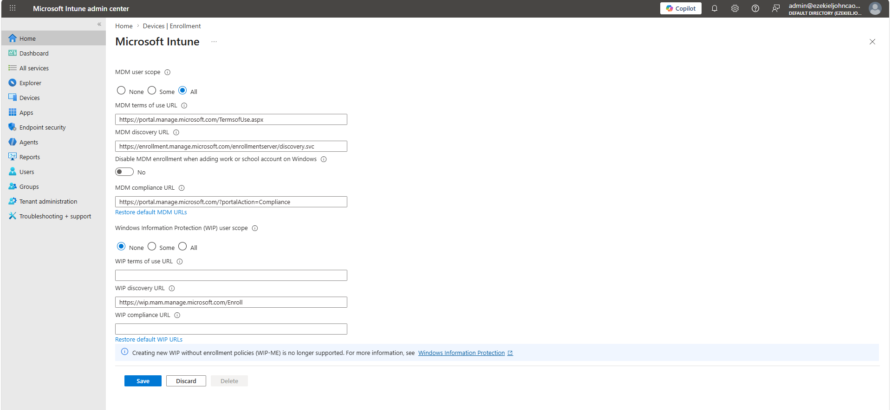

**Pushing the Intune auto-enrollment GPO to the Workstations OU**
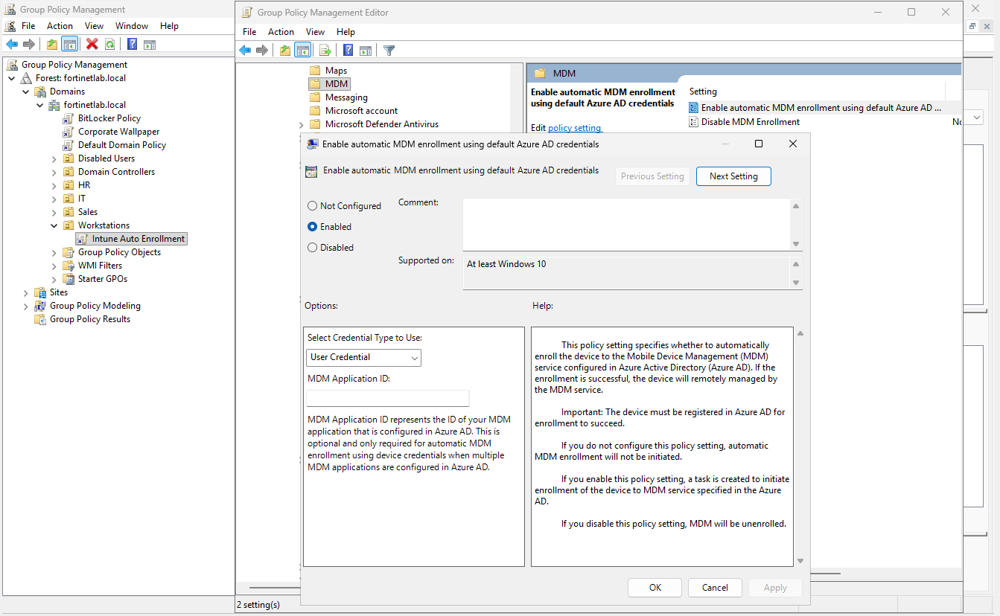

**Device picking up enrollment with dsregcmd showing AzureAdJoined**
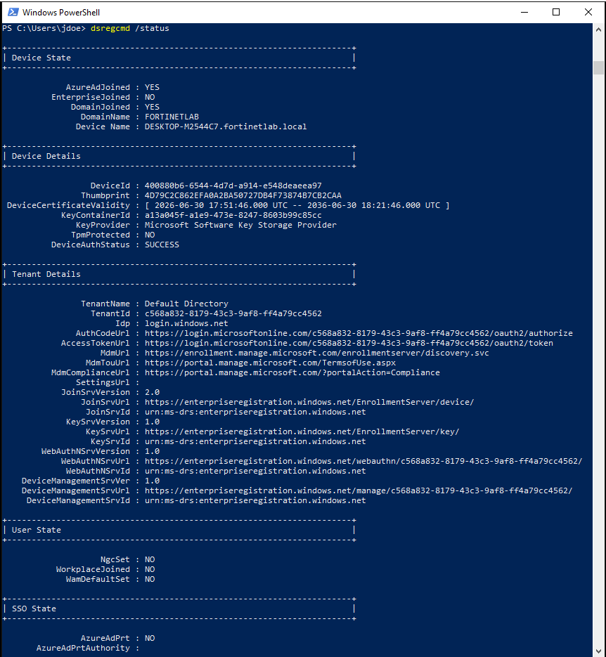

**Enrollment diagnostic detail (tenant and device registration data)**
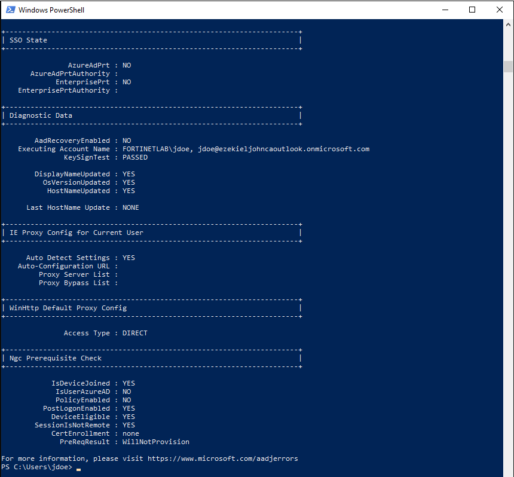

**Client showing as managed and compliant in the Intune console**
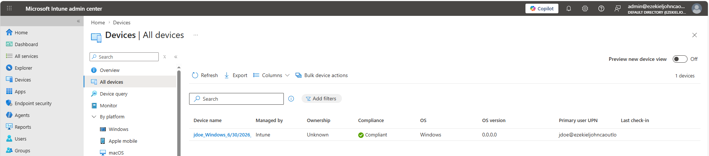

**Creating a Settings Catalog configuration profile in Intune**
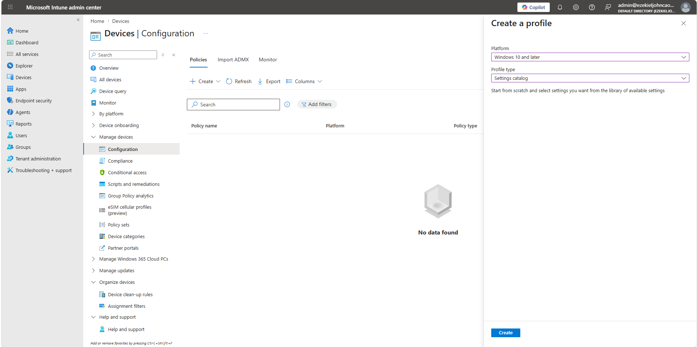

**Configuring the profile to disable Windows Copilot**
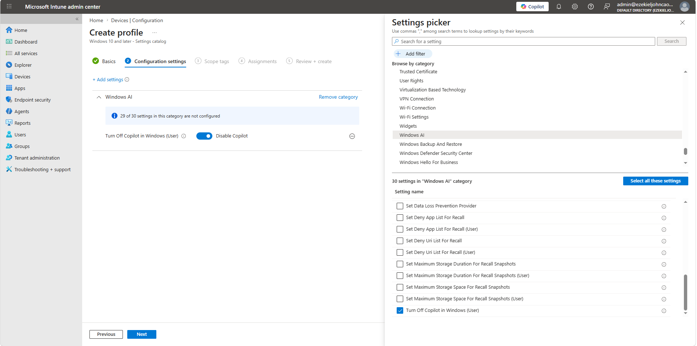

**Assigning the profile to the IT_Users group**
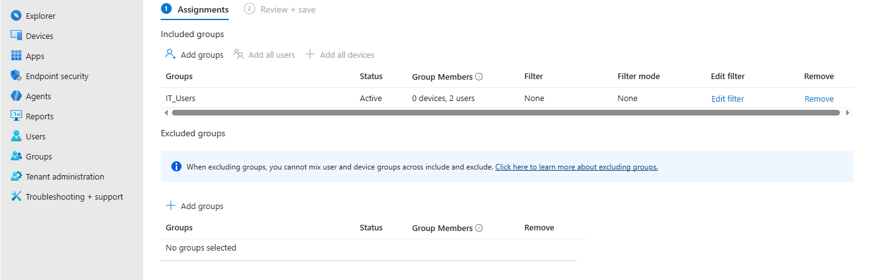

**Before: Copilot present on the client**
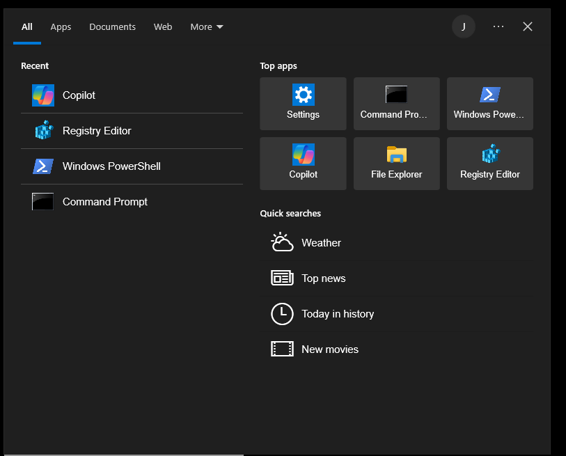

**After: Copilot removed once the Intune profile applied**
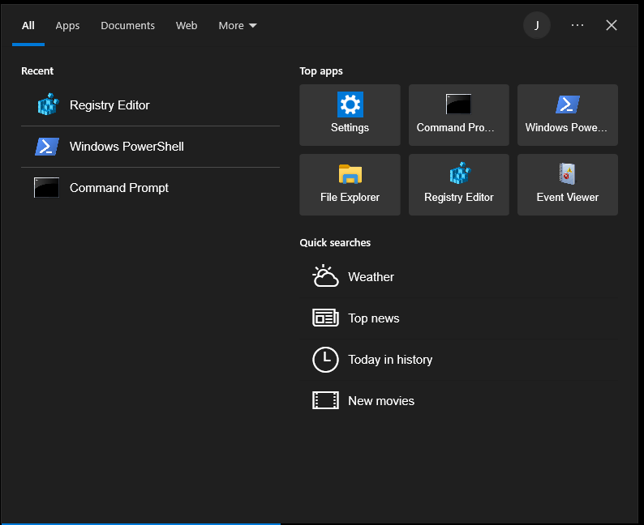
