# Phase 12: SSL Deep Inspection

This phase turns on SSL deep inspection on the FortiGate so it can see inside HTTPS traffic. Because the firewall re-signs that traffic, I pushed its CA certificate out to the client using both GPO and Intune, and I ran into a real limit in the eval license that I wrote up honestly.

## What I Did

On the FortiGate I selected the customizable deep-inspection SSL/SSH profile and exported its CA certificate (Fortinet_CA_SSL). To make clients trust the re-signed traffic, I distributed that CA two ways. First via on-prem Group Policy: I created a "FortiGate SSL Inspection CA Trust" GPO, imported the certificate into Computer Configuration → Public Key Policies → Trusted Root Certification Authorities, forced `gpupdate` on DC01 and the client, and confirmed through an MMC Certificates snap-in that the certificate landed in the machine's Trusted Root store. Then via Intune (the method I kept): a Trusted Certificate configuration profile targeting the Computer certificate store (Root), assigned to all devices, which I confirmed in `certlm.msc` after syncing the client. On the firewall I bound the custom-deep-inspection profile to the LAN-to-WAN policy and enabled the Web Filter alongside it (SSL inspection needs another profile active to actually engage). Browsing to an HTTPS site then showed the certificate had been re-issued by the FortiGate's CA rather than the site's real issuer, which is direct proof the firewall was intercepting and re-signing the connection.

## Key Takeaways

Deep SSL inspection is a man-in-the-middle by design, so it only works if every client trusts the firewall's inspection CA, which is exactly why certificate distribution (GPO or Intune) is inseparable from the feature. Doing it both ways was a useful comparison: GPO is the classic on-prem approach, while an Intune Trusted Certificate profile is the cloud-managed equivalent, and I retained Intune as the real method. The honest limitation: the evaluation license/VM tier generates its SSL inspection CA with a weak 512-bit RSA key, and the evaluation tier blocked generating a stronger 2048-bit replacement. Modern browsers reject 512-bit keys outright (ERR_CERT_WEAK_KEY), so although interception provably worked, and the re-signed certificate chain confirms it, full, reliable SSL inspection isn't achievable on this lab tier. Recognizing and documenting a hard licensing/architectural constraint is itself a real-world skill.

## Screenshots

**Selecting the customizable deep-inspection SSL/SSH profile**
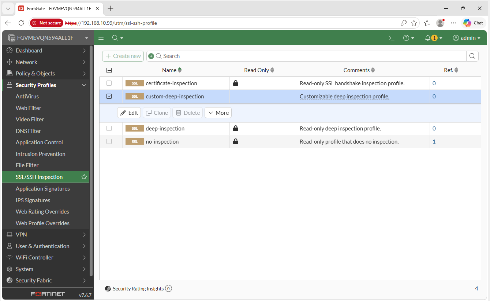

**Exporting the FortiGate's SSL inspection CA certificate (Fortinet_CA_SSL)**
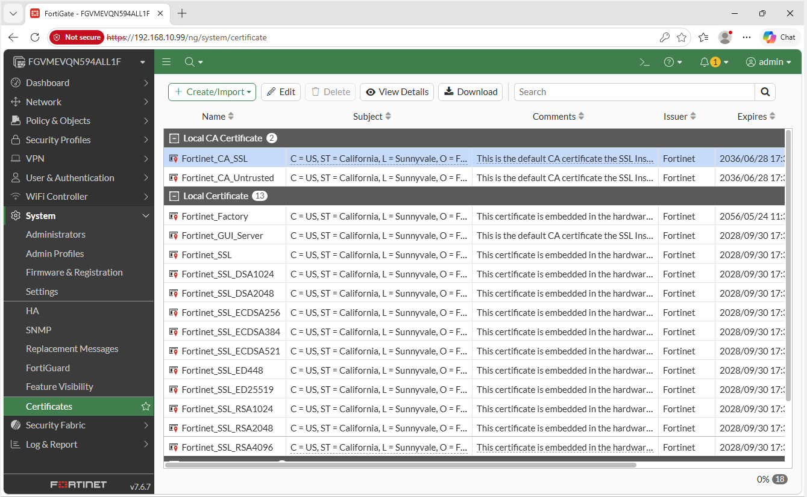

**Creating the GPO to distribute the inspection CA**
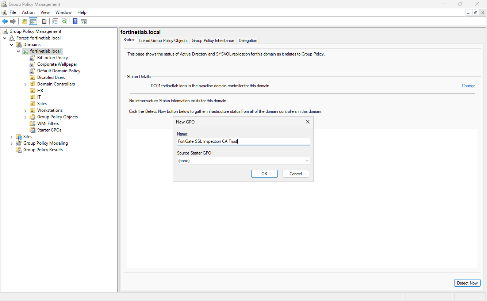

**Importing the CA into Trusted Root Certification Authorities via GPO**
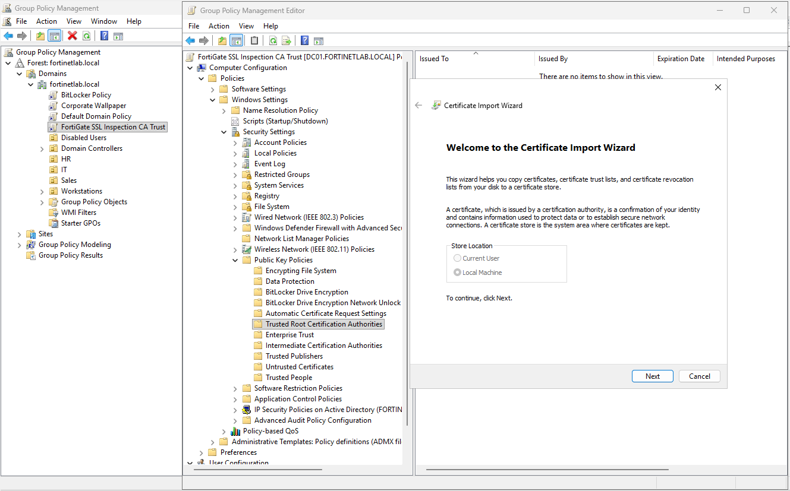

**CA certificate imported into the GPO's Trusted Root store**
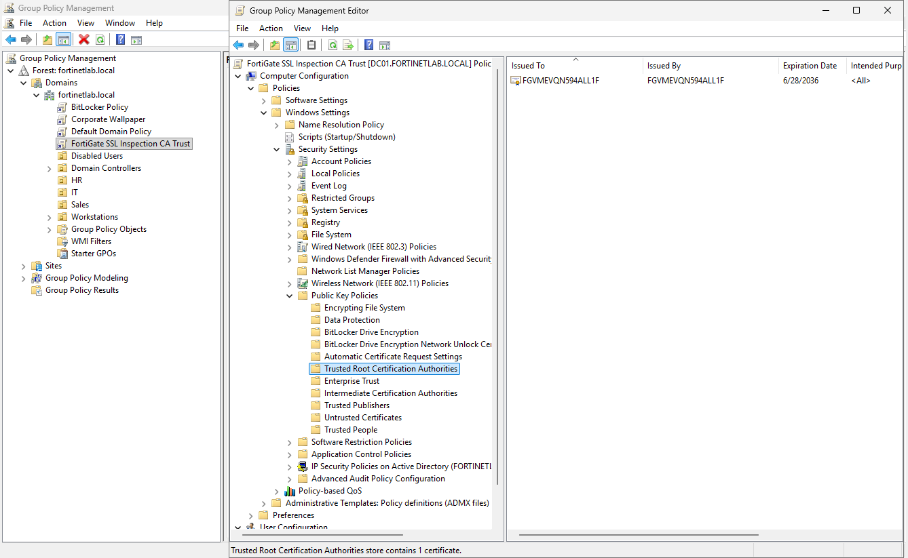

**Forcing gpupdate on DC01**
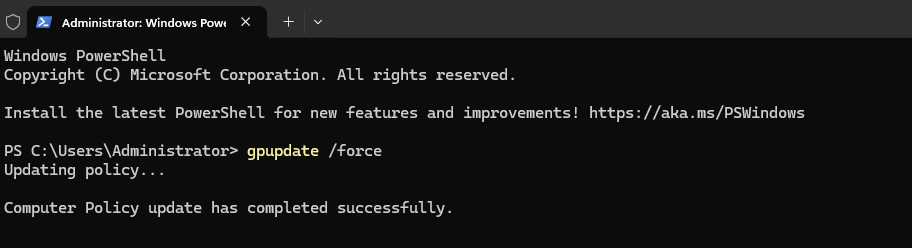

**Forcing gpupdate on the WIN10 client**
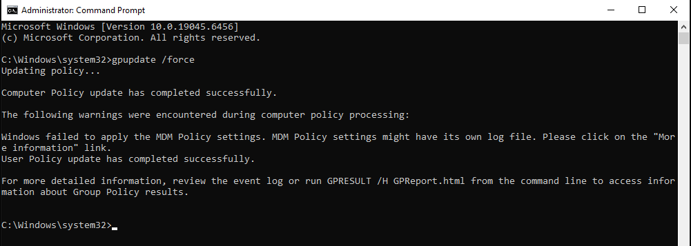

**Building an MMC Certificates snap-in for the computer account**
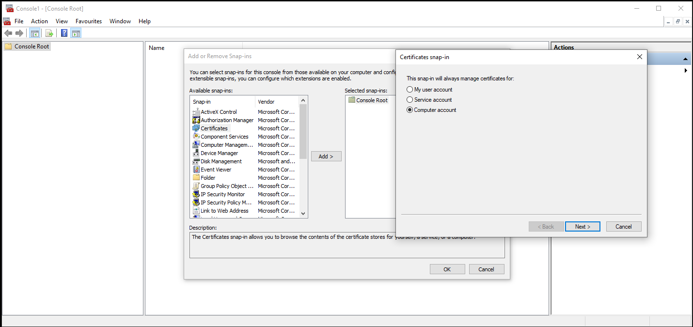

**CA certificate present in the client's Trusted Root store (via GPO)**
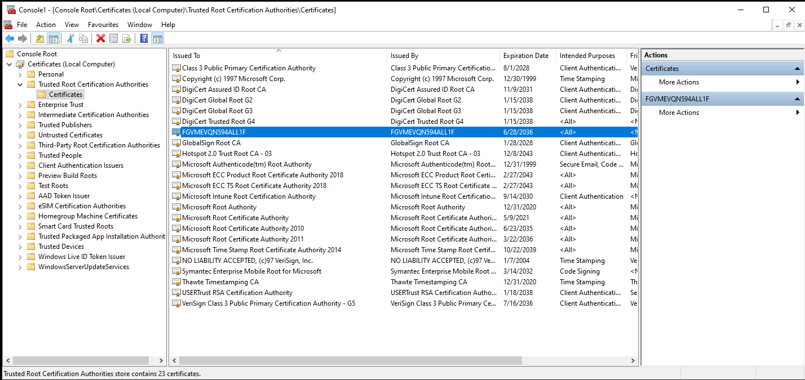

**Creating a Trusted Certificate profile in Intune (the retained method)**
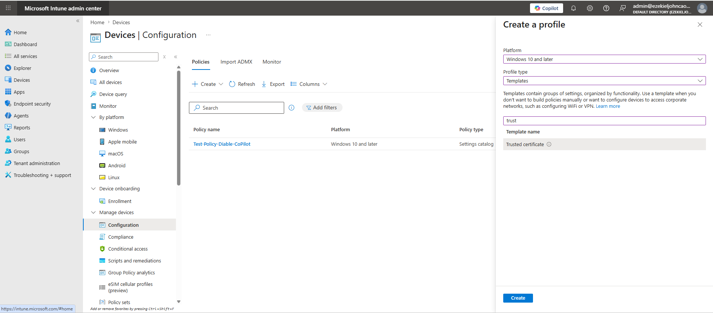

**Configuring the Intune profile with Fortinet_CA_SSL.cer to the Root store**
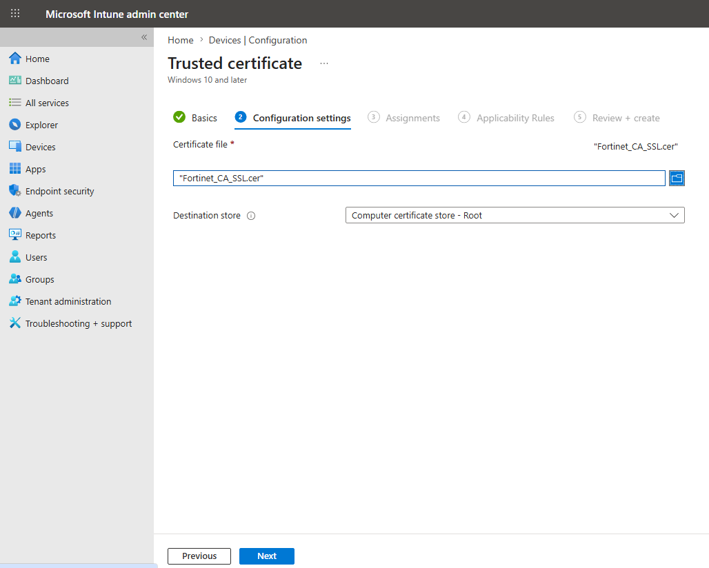

**Assigning the certificate profile to all devices**
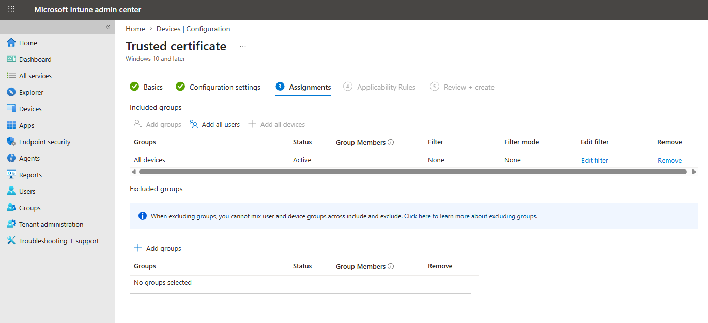

**Syncing the client to pull the new Intune profile**
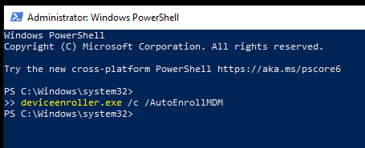

**Confirming the CA certificate in certlm on the client**
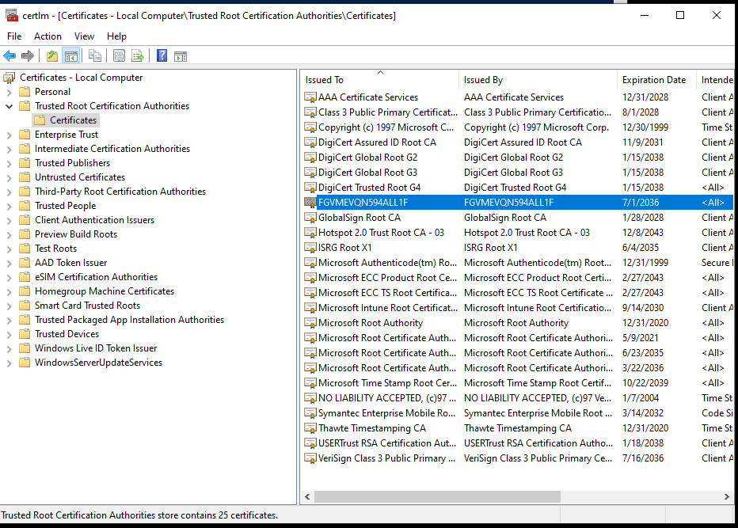

**Binding the custom-deep-inspection profile to the LAN-to-WAN policy**
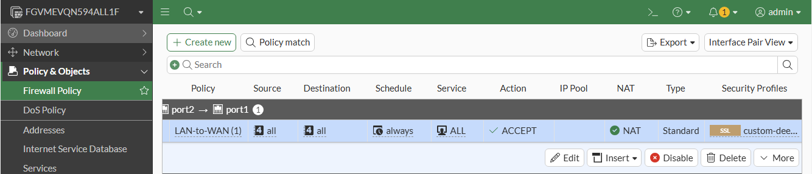

**Enabling the Web Filter alongside SSL inspection on the policy**
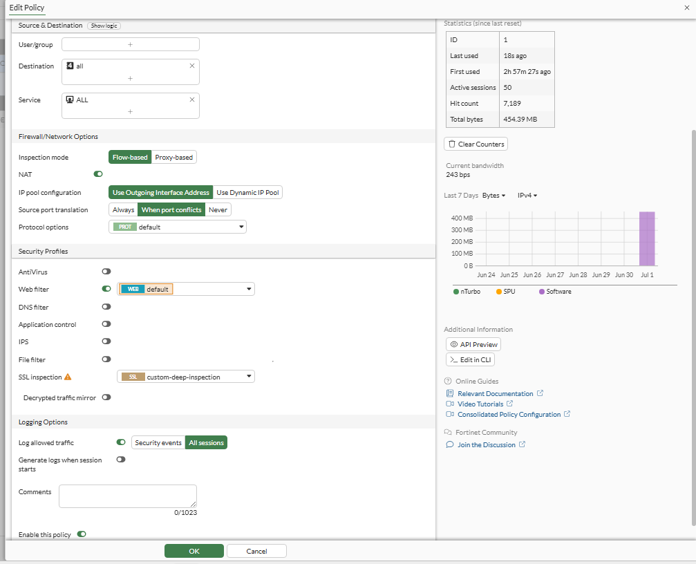

**HTTPS traffic re-signed by the FortiGate CA, interception confirmed**
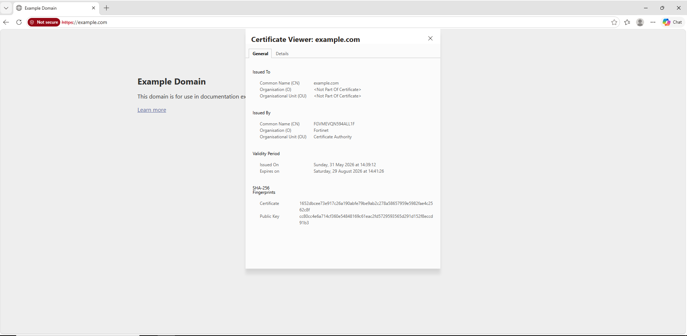
